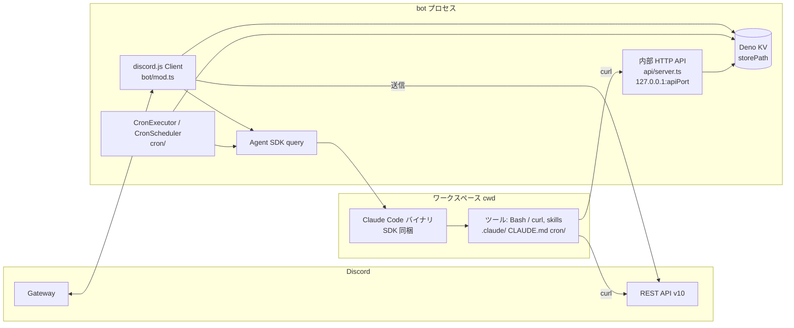
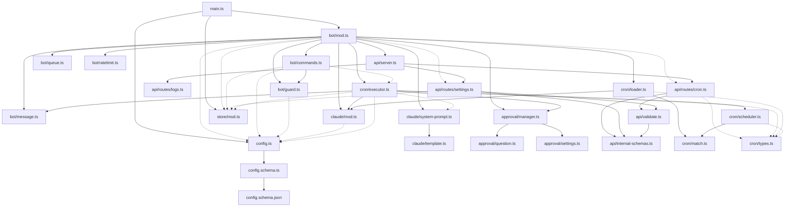

# アーキテクチャ

loms-claw の現状のアーキテクチャを章立てで記述する正本。構成の把握に必要な全体像 (目的・技術スタック・システムコンテキスト・モジュール依存・ファイル構成) と各章への索引をこのファイルに置き、個々の仕組みは各章に分ける。ルート [CLAUDE.md](../../CLAUDE.md) は不変条件・規約・索引に絞り、仕組みの記述はこのディレクトリを参照する。記述はソースコードを正とし、コードと食い違う場合はコードが優先する。

関連: [利用規約に関する注意](../terms-of-service.md) / [内部 API 定義](../api/README.md) / [CLAUDE.md](../../CLAUDE.md) / [エージェント向け指示書](../../data/workspace/CLAUDE.md)

## 目的

Discord の単一ギルド・単一ユーザ専用のパーソナル AI エージェント。Discord のメッセージや定期実行 (cron) を起点に Claude Agent SDK の `query()` を呼び出し、SDK 同梱の Claude Code バイナリをエージェントワークスペース上で動かして結果を Discord に返す。

利用規約上の根拠と経緯は [docs/terms-of-service.md](../terms-of-service.md) にまとめている。実装時に守る不変条件は次の 2 点である。

- `bot/guard.ts` の `isAuthorized()` による単一ギルド ID・単一ユーザ ID (サブスクリプション購入者本人) との完全一致要求を崩さない。bot 自身の投稿による起動は `isAuthorizedSelfMessage()` で別途判定するが、同一ギルド内の自 bot の投稿に限られ、第三者のリクエストが流入する経路にはならない。
- cron による自動実行の頻度・規模を「個人の通常利用」の範囲に保つ。

## 技術スタック

`deno.json` の `imports` と `unstable` から。

| 技術                             | 用途                                                                                           |
| -------------------------------- | ---------------------------------------------------------------------------------------------- |
| Deno                             | ランタイム。`unstable: ["temporal", "kv"]` を有効化                                            |
| discord.js v14                   | Discord Gateway への接続、メッセージ受信、ボタン / select menu / Modal、スラッシュコマンド登録 |
| `@anthropic-ai/claude-agent-sdk` | `query()` による Claude 呼び出し。同梱の Claude Code バイナリを SDK が spawn する              |
| Hono (`@hono/hono`)              | 内部 HTTP API (`127.0.0.1:{apiPort}`)                                                          |
| Deno KV                          | スコープ単位の設定・セッション ID の永続化 (`storePath`、SQLite backend)                       |
| Temporal                         | cron 式のローカルタイム評価 (`cron/match.ts`)、レートリミッタの時刻計算 (`bot/ratelimit.ts`)   |
| `@cfworker/json-schema`          | `config.json`・内部 API リクエストボディ・cron frontmatter の構造検証                          |
| `json-schema-to-ts`              | 内部 API の schema から TypeScript 型を導出 (`FromSchema`)                                     |
| `@std/front-matter`              | cron ジョブファイルの YAML frontmatter 抽出                                                    |
| `@std/path`, `@std/assert`       | パス操作、テストアサーション                                                                   |

コンテナイメージ (`Dockerfile`) には `curl` / `jq` (Discord REST を叩く skill 用)、`ffmpeg` (添付画像のリサイズ、`bot/message.ts` の `resizeImageIfNeeded()`)、`git` / `bubblewrap` / `socat` が同梱される。

## システムコンテキスト

- bot プロセスは discord.js の `Client` で Gateway に接続し、`messageCreate` / `interactionCreate` を受ける (`bot/mod.ts` の `DiscordBot`)。応答・承認ボタン・cron 結果の投稿は同じ Client から送る。
- Claude 呼び出しは `claude/mod.ts` の `askClaude()` が Agent SDK の `query()` を呼ぶ。`cwd` はプロセス起動時の `Deno.cwd()` (`config.ts` の `loadConfig()` が `claude.cwd` として注入)。本番では `/data/workspace`、devcontainer ではソースリポジトリ自身になる。
- Claude 側からの Discord 操作は bot プロセスを経由せず、SDK 同梱バイナリが spawn する Bash + curl で Discord REST API を直接叩く。bot トークンは `claude/mod.ts` の `buildQueryOptions()` が `query()` の `env` に `DISCORD_BOT_TOKEN` として注入する。
- 内部 HTTP API は cron 操作・ログ取得・スコープ設定の操作を `127.0.0.1` に提供し、Claude から curl で呼ばれる。ツール承認は in-process (`canUseTool` コールバック) で、HTTP では扱わない。
- 永続化は Deno KV 1 ファイル (`config.json` の `storePath`) のみ。`main.ts` が open し、`Store` (`store/mod.ts`) 経由で bot / cron / API が共有する。

## モジュール依存と層構造

`import ... from` をソースから抽出した依存グラフ。`logger.ts` と `errors.ts` はほぼ全モジュールから参照される横断ユーティリティのため辺を省略している。点線は型のみの import (`import type`)。

層として読むと次のようになる。循環依存は無い。

| 層           | モジュール                                                                      | 役割                                                                                                                               |
| ------------ | ------------------------------------------------------------------------------- | ---------------------------------------------------------------------------------------------------------------------------------- |
| エントリ     | `main.ts`                                                                       | 設定読込 → ロガー初期化 → KV open → `DiscordBot` 起動 (リトライ付き)                                                               |
| 合成ルート   | `bot/mod.ts`                                                                    | 全サブシステムを生成・接続する唯一の場所                                                                                           |
| サブシステム | `bot/*` (mod 以外), `claude/*`, `store/mod.ts`, `approval/*`, `api/*`, `cron/*` | 各ディレクトリが 1 つの関心事を担う。ディレクトリをまたぐ参照は下記の例外のみ                                                      |
| 横断基盤     | `config.ts`, `config.schema.ts`, `config.schema.json`, `logger.ts`, `errors.ts` | 設定・ログ・エラー整形。サブシステムに依存しない (内部では `config.ts` → `config.schema.ts` / `errors.ts` / `logger.ts` (型) のみ) |

サブシステム間でディレクトリをまたぐ辺は次に限られる。

- `cron/executor.ts` → `claude/mod.ts`, `claude/system-prompt.ts` (型), `approval/manager.ts`, `store/mod.ts` (型): cron も bot と同じ経路で Claude を呼び、承認・セッションを扱うため
- `cron/executor.ts` → `bot/message.ts` (`splitMessage`): 結果投稿の 2000 文字分割を bot と共有
- `cron/loader.ts` → `claude/mod.ts` (`EFFORT_LEVELS`): frontmatter の `effort` 検証に effort の定義を共有
- `bot/commands.ts` → `cron/executor.ts` (型のみ)
- `api/routes/*` → `store/mod.ts` (型), `cron/types.ts` (型): API は実体を `bot/mod.ts` から `CronRouteContext` / `SettingsRouteContext` として注入される

## ディレクトリ / ファイル構成

`git ls-files` で確認した構成。テストは各モジュールと同じディレクトリに `*.test.ts` として置く (`bot/queue_test.ts` のみ例外)。

### ルート

| パス                  | 役割                                                                                                                                                                                |
| --------------------- | ----------------------------------------------------------------------------------------------------------------------------------------------------------------------------------- |
| `main.ts`             | エントリポイント。`loadConfig()` → `initLogger()` → `Deno.openKv()` → `new DiscordBot().start()`。指数バックオフで最大 5 回リトライ。SIGINT / SIGTERM で `shutdown()`               |
| `config.ts`           | `config.json` → `Config` 型。`LOMS_CLAW_CONFIG` でパス変更可 (既定 `./data/config.json`)。`claude.cwd` に `Deno.cwd()` を注入                                                       |
| `config.schema.json`  | 設定の JSON Schema 本体。`config.json` 側で `$schema` として参照すれば IDE 補完が効く                                                                                               |
| `config.schema.ts`    | `@cfworker/json-schema` の `Validator` で検証。`applyConfigDefaults()` が schema の `default` を補完                                                                                |
| `logger.ts`           | 名前空間付きロガー。`initLogger()` / `createLogger()` / `getLogEntries()`。リングバッファで直近ログを保持                                                                           |
| `errors.ts`           | `getErrorMessage()`: unknown なエラー値からメッセージを取り出す                                                                                                                     |
| `deno.json`           | imports / tasks / fmt / lint 設定。`exclude` に `data/`, `docs/api`, `api/internal-schemas.ts`, `.claude/worktrees/`                                                                |
| `Dockerfile`          | `denoland/deno` ベース。`CLAUDE_CONFIG_DIR` / `LOMS_CLAW_CONFIG` を `ENV` で宣言。SDK 同梱 Claude Code を `/usr/local/bin/claude` に symlink。`WORKDIR /data/workspace`             |
| `compose.yaml`        | 本番サービス定義。`./data` を `/data` に bind mount (マウントはこの 1 つ)。`TZ` を `.env` から渡す                                                                                  |
| `.devcontainer/`      | 開発コンテナ定義。`compose.yaml` にソースの `/app` bind mount を重ねる                                                                                                              |
| `.github/`            | `dependabot.yml` (deno はルートと `docs/api` の 2 エントリ、加えて docker / github-actions)、`workflows/claude.yml` (issue / PR コメントの `@claude` で起動する Claude Code Action) |
| `.claude/rules/pr.md` | PR 作成前の検証チェーン (`deno task fix && deno task check && deno task lint && deno task test`)                                                                                    |
| `.worktreeinclude`    | worktree 作成時にメイン worktree から複製するローカル資産 (`.env`, `data/config.json`, `data/home/`, `data/workspace/`)                                                             |
| `.env.example`        | docker compose が host 側で読む変数 (`TZ` のみ)                                                                                                                                     |
| `LICENSE`             | MIT License                                                                                                                                                                         |
| `CLAUDE.md`           | 開発者・エージェント向けのプロジェクト指示 (不変条件・規約・索引)                                                                                                                   |

### `bot/` — Discord 入出力

| パス               | 役割                                                                                                                                                                                                                              |
| ------------------ | --------------------------------------------------------------------------------------------------------------------------------------------------------------------------------------------------------------------------------- |
| `bot/mod.ts`       | `DiscordBot` クラス。`messageCreate` / `interactionCreate` ハンドラ、`start()` (ClientReady 後にコマンド登録 → cron 初期化 → API サーバ起動)、`shutdown()`                                                                        |
| `bot/commands.ts`  | スラッシュコマンド `/claw settings show\|set\|unset` の定義とハンドラ。`set` は model / effort / show_thinking / active、`unset` はそれに session を加えた対象を取る                                                              |
| `bot/guard.ts`     | `isAuthorized()` (ギルド + ユーザ + bot 除外)、`resolveActive()`、`shouldRespond()`、`isAuthorizedSelfMessage()` (AI to AI 自己メンション)                                                                                        |
| `bot/queue.ts`     | `ScopeQueue`: scope 単位でメッセージ処理を直列化                                                                                                                                                                                  |
| `bot/ratelimit.ts` | `SelfMentionRateLimiter`: 自己メンション応答のスライディングウィンドウレート制限 (bot 全体、Temporal ベース)                                                                                                                      |
| `bot/message.ts`   | `splitMessage()`、`keepTyping()`、`createProgressReporter()`、`stripBotMentions()`、画像添付の取得・リサイズ・後始末 (`downloadImageAttachments()` / `resizeImageIfNeeded()` / `appendImageReferences()` / `cleanupImageFiles()`) |

### `claude/` — Agent SDK 連携

| パス                      | 役割                                                                                                                                               |
| ------------------------- | -------------------------------------------------------------------------------------------------------------------------------------------------- |
| `claude/mod.ts`           | `askClaude()`: `query()` を呼び `SDKMessage` を逐次 yield。`buildQueryOptions()` / `normalizeEffort()` / `EFFORT_LEVELS`。`queryFn` の DI でテスト |
| `claude/system-prompt.ts` | `SystemPromptStore`: `.claude/system-prompt/` 配下を起動時に読み込み、コンテキスト (chat / cron) とスコープに応じて結合                            |
| `claude/template.ts`      | `replaceTemplateVariables()`: `{{key}}` 置換                                                                                                       |

### `store/` — 永続化

| パス           | 役割                                                                                                                                         |
| -------------- | -------------------------------------------------------------------------------------------------------------------------------------------- |
| `store/mod.ts` | `Store`: Deno KV によるスコープ (`{channelId, threadId?}`) 単位の session / model / effort / showThinking / active の永続化と `applyPatch()` |

### `approval/` — ツール承認

| パス                   | 役割                                                                                                                     |
| ---------------------- | ------------------------------------------------------------------------------------------------------------------------ |
| `approval/manager.ts`  | `ApprovalManager`: Discord ボタンによる承認 / 拒否。`createCanUseTool()` が SDK の `canUseTool` コールバックを生成       |
| `approval/question.ts` | `QuestionManager`: `AskUserQuestion` を select menu (+ Other 自由入力の Modal) で提示し回答を収集                        |
| `approval/settings.ts` | `isInAllowList()` / `addToSettingsAllowList()`: ワークスペースの `.claude/settings.json` の `permissions.allow` 読み書き |

### `api/` — 内部 HTTP API

| パス                      | 役割                                                                                                                         |
| ------------------------- | ---------------------------------------------------------------------------------------------------------------------------- |
| `api/server.ts`           | `startApiServer()`: Hono アプリ作成、cron / health / logs / settings ルートのマウント、共通エラーハンドラ                    |
| `api/routes/cron.ts`      | `GET /cron`, `POST /cron/run`, `POST /cron/reload`。`CronRouteContext` を受け取る                                            |
| `api/routes/health.ts`    | `GET /health`。`HealthRouteContext { isReady }` を受け取り、healthy なら 200、そうでなければ 503 を返す                      |
| `api/routes/logs.ts`      | `GET /logs`。`logger.ts` のリングバッファからフィルタ付きで取得                                                              |
| `api/routes/settings.ts`  | `GET /settings/default`, `GET` / `PATCH` / `DELETE /settings/:id`。`SettingsRouteContext` を受け取る                         |
| `api/validate.ts`         | `matchesSchema()` / `schemaErrorOf()`: `internal-schemas.ts` を単一ソースに `@cfworker/json-schema` でリクエストボディを検証 |
| `api/internal-schemas.ts` | `docs/api` の component schema から `deno task generate` で書き出す自動生成物。`deno.json` の `exclude` 対象                 |

### `cron/` — 定期実行

| パス                | 役割                                                                                                    |
| ------------------- | ------------------------------------------------------------------------------------------------------- |
| `cron/types.ts`     | `CronJobDef` 型                                                                                         |
| `cron/match.ts`     | cron 式パーサー + マッチャー (`parseCronExpression()` / `matchesCron()`)。Temporal でローカルタイム評価 |
| `cron/loader.ts`    | frontmatter パーサー + `cron/` ディレクトリスキャン (`loadCronJobsFromDir()` / `validateCronJob()`)     |
| `cron/scheduler.ts` | `CronScheduler`: `setInterval` ベースのスケジューラ                                                     |
| `cron/executor.ts`  | `CronExecutor`: スケジューラ連携 + `askClaude()` → Discord 送信                                         |

### `docs/`, `data/`

| パス                       | 役割                                                                                                                                                                                                          |
| -------------------------- | ------------------------------------------------------------------------------------------------------------------------------------------------------------------------------------------------------------- |
| `docs/architecture/`       | 本ディレクトリ                                                                                                                                                                                                |
| `docs/terms-of-service.md` | 利用規約上の根拠・引用・経緯                                                                                                                                                                                  |
| `docs/api/`                | 内部 HTTP API の OpenAPI 定義 (`api.yaml`, `paths/`, `components/schemas/`, `examples/`)。独自の `deno.json` / `deno.lock` を持ち、ルートの `deno task generate` から `bin/emit-server-schemas.ts` が呼ばれる |
| `data/config.json.example` | アプリ設定の雛形。`data/config.json` にコピーして使う (`data/config.json` は git 管理外)                                                                                                                      |
| `data/home/`               | Claude の設定・認証情報 (`CLAUDE_CONFIG_DIR`)。`.gitkeep` のみ追跡                                                                                                                                            |
| `data/workspace/`          | エージェントワークスペース (`query()` の `cwd`)。`CLAUDE.md`, `.claude/` (rules / skills / system-prompt / settings.json), `cron/` のみ追跡し、`memory/` や KV ファイルは管理外                               |

## 章立て

| 章                                             | 内容                                                                                        |
| ---------------------------------------------- | ------------------------------------------------------------------------------------------- |
| [lifecycle.md](lifecycle.md)                   | 起動 / 終了シーケンス、設定 (`config.ts` / schema)、ロガー                                  |
| [message-flow.md](message-flow.md)             | Discord メッセージ処理の流れ、AI to AI 自己メンション、インタラクション (ボタン / コマンド) |
| [claude-integration.md](claude-integration.md) | `askClaude()` と `query()` オプション、システムプロンプト、テンプレート変数                 |
| [store-and-settings.md](store-and-settings.md) | `Store`、スコープ解決、`/claw settings`、settings API                                       |
| [approval.md](approval.md)                     | ツール承認、`AskUserQuestion`、allowlist (`.claude/settings.json`)                          |
| [cron.md](cron.md)                             | 定期実行 (ジョブファイル形式、スケジューラ、実行、once、reload)                             |
| [internal-api.md](internal-api.md)             | 内部 HTTP API、`docs/api` (OpenAPI) と検証パイプライン                                      |
| [deployment.md](deployment.md)                 | Docker / compose / devcontainer、`data/` ディレクトリ、環境変数、ワークスペース構成         |

## 関連ドキュメント

- [../terms-of-service.md](../terms-of-service.md): 利用規約上の根拠と不変条件の経緯
- [../api/README.md](../api/README.md): 内部 HTTP API の OpenAPI 定義 (接続・エラー応答)
- [../../CLAUDE.md](../../CLAUDE.md): 開発者・エージェント向けのプロジェクト指示 (不変条件・規約・索引)
- [../../data/workspace/CLAUDE.md](../../data/workspace/CLAUDE.md): ワークスペースで動く Claude に向けた指示書 (振る舞い・cron・skills)
