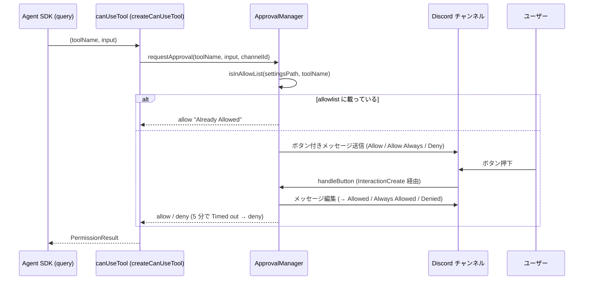

# ツール承認 (canUseTool / AskUserQuestion / allowlist)

Claude Agent SDK がツールを使う前に呼ぶ `canUseTool` コールバックを in-process で実装し、Discord のボタン / select menu / Modal でユーザーの承認・回答を集める仕組み。`approval/manager.ts` の `ApprovalManager` と `createCanUseTool()`、`approval/question.ts` の `QuestionManager`、`approval/settings.ts` の allowlist 読み書きで構成される。承認 UI の送信先チャンネルは呼び出し側 (`bot/mod.ts` / `cron/executor.ts`) がターンごとに決める。

関連: [README](README.md) / [message-flow](message-flow.md) / [claude-integration](claude-integration.md) / [cron](cron.md) / [deployment](deployment.md)

## 全体像

許可判定は 2 層ある。

| 層                          | 場所                                                         | 挙動                                                                                                                                                            |
| --------------------------- | ------------------------------------------------------------ | --------------------------------------------------------------------------------------------------------------------------------------------------------------- |
| SDK 側 allowlist            | `.claude/settings.json` の `permissions.allow` (SDK が読む)  | `claude/mod.ts` の `buildQueryOptions()` が `settingSources: ["user", "project"]` を指定するため SDK 自身が読む。載っているツールは `canUseTool` を呼ばずに通す |
| アプリ側 allowlist 事前判定 | `ApprovalManager.requestApproval()` 冒頭の `isInAllowList()` | 同じファイルを読み、載っていれば Discord に聞かず即 allow (`reason: "Already Allowed"`) を返す                                                                  |

どちらも同一ファイルを参照する。`Allow Always` で追記されたツールは、以降の `requestApproval()` がファイルを読み直すためアプリ側の事前判定で即 allow になり、次回の `query()` からは SDK 側で事前許可される (`approval/settings.ts` の doc コメント)。

`.claude/settings.json` のパスは `bot/mod.ts` の `DiscordBot` コンストラクタで `join(config.claude.cwd, ".claude", "settings.json")` として `ApprovalManager` に渡される。`config.claude.cwd` は `config.ts` の `loadConfig()` が `Deno.cwd()` を注入する値で、本番 (Docker) ではワークスペースの `/data/workspace` になる (host では `data/workspace/.claude/settings.json`)。中身の allowlist は運用依存のためここでは列挙しない。配置は [deployment](deployment.md) を参照。

Discord のボタン承認が発火するのは、上の表のとおり SDK 上の既定 (allow に無いツール) が呼ばれたときに限る。ワークスペースの `settings.json` の `permissions.allow` では組み込みツール群と一部の MCP ツールを事前許可している。一覧は `data/workspace/.claude/settings.json` を正とする。旧名 (現行 MCP に存在しない `gcal_*` / `gmail_*` の 4 件) の削除は行ったが、有効な許可範囲は変えていない。allowlist は現状維持 (縮小しない) と 2026-08-23 に判断した (#120)。

## ApprovalManager (`approval/manager.ts`)

### 状態

| フィールド        | 型                                     | 用途                                                                                                                                                                                                           |
| ----------------- | -------------------------------------- | -------------------------------------------------------------------------------------------------------------------------------------------------------------------------------------------------------------- |
| `pending`         | `Map<requestId, { resolve, timeout }>` | 応答待ちの承認リクエスト。`requestId` は `crypto.randomUUID().slice(0, 8)`                                                                                                                                     |
| `channelId`       | `string \| null`                       | `setChannel()` で設定される共有の可変状態。チャットと cron の両方のターン開始時に上書きされるため、同時に走るターン間で共有される。`requestApproval()` に明示の `channelId` が渡された場合はそちらが優先される |
| `questions`       | `QuestionManager`                      | `AskUserQuestion` 用。コンストラクタで同じ `Client` から生成                                                                                                                                                   |
| `settingsPath`    | `string`                               | `.claude/settings.json` の絶対パス                                                                                                                                                                             |
| `channelResolver` | `ApprovalChannelResolver`              | `requestApproval()` のチャンネル解決 (`fetchSendable(channelId)`)。コンストラクタの `options.channelResolver` で差し替え可能 (既定は `client` から作った discord.js 実装)。テストで fake に差し替える          |
| `timeoutMs`       | `number`                               | 承認待ちのタイムアウト。既定は `INTERACTION_TIMEOUT_MS`。コンストラクタの `options.timeoutMs` でテスト用に短縮可能                                                                                             |

### `requestApproval(toolName, toolInput, channelId?)`

1. `isInAllowList(settingsPath, toolName)` が true なら即 `{ decision: "allow", reason: "Already Allowed" }`。
2. チャンネル解決: 引数 `channelId` → `this.channelId` の順。どちらも無ければ `{ decision: "deny", reason: "No approval channel" }`。`channelResolver.fetchSendable(channelId)` が `null` を返す (取得できない、またはテキストチャンネルでない) 場合は `{ decision: "deny", reason: "Channel not found" }`。
3. 以下を投稿する。
   - ボタン 3 種: `approve:{requestId}` (Allow, Success) / `always:{requestId}:{toolName}` (Allow Always, Primary) / `deny:{requestId}` (Deny, Danger)
   - 本文: 1 行目に `Tool: {toolName}` (太字 + インラインコード)、`toolInput.description` があればその値、続けて `toolInput` の 2 スペース JSON ダンプを json コードフェンスで囲んだもの。ダンプは 1500 文字を超える場合 1497 文字 + `...` に切り詰める
4. `pending` に登録し Promise を返す。`handleButton()` が解決するか、`INTERACTION_TIMEOUT_MS` (`approval/constants.ts`、5 分) 経過で `{ decision: "deny", reason: "Timed out" }` に解決する。タイムアウト時に投稿メッセージは編集しない。

### `handleButton(interaction)`

`bot/mod.ts` の `onInteraction()` から `interaction.isButton()` のとき呼ばれる (振り分けは [message-flow](message-flow.md))。

1. まず `QuestionManager.handleButton()` に渡し、質問側の Cancel ボタン (`question-cancel:{requestId}`) なら終了。
2. `customId` を `:` で分割し、`approve` / `always` / `deny` 以外、または `requestId` 欠落なら `false` を返す。
3. `pending` に無い (期限切れ・処理済み) なら ephemeral で「この承認リクエストは期限切れか、既に処理済みです。」と返す。
4. timeout を解除し `pending` から削除する。
5. `always` なら `customId` 第 3 要素のツール名で `addToSettingsAllowList(settingsPath, toolName)` を呼ぶ。失敗しても WARN ログのみで承認自体は続行する。
6. `approve` / `always` → `decision: "allow"`、`deny` → `decision: "deny"`。`reason` はラベル (`Allowed` / `Always Allowed` / `Denied`)。
7. 元メッセージを `interaction.update()` で `\n**→ {ラベル}**` を追記しボタンを外す。

### `addToSettingsAllowList()` / `isInAllowList()` (`approval/settings.ts`)

- `isInAllowList(settingsPath, toolName)`: ファイルを読んで `permissions.allow` 配列に `toolName` が含まれるか。ファイル不在・JSON 不正は false。
- `addToSettingsAllowList(settingsPath, toolName)`: ファイルが無ければ空オブジェクトから作る (NotFound 以外の読み込みエラーは throw)。JSON 不正なら WARN ログを出して上書き。`permissions` / `permissions.allow` が無ければ作り、既存フィールドは保持してマージ。重複なら追加しない。親ディレクトリを `mkdir -p` 相当で作り、`JSON.stringify(settings, null, 2) + "\n"` で書き出す。

## QuestionManager (`approval/question.ts`)

`AskUserQuestion` は承認ではなく回答収集のツールなので、ボタン承認とは別の UI (string select + Cancel ボタン + Other 用 Modal) を使う。チャンネル解決 (`channelId ?? this.channelId`) は `ApprovalManager.requestAnswers()` が行い、以降は `QuestionManager` に委譲する。

### `parseQuestions(input)`

`canUseTool` が受けた入力から `Question[]` を取り出す純粋関数。次のいずれかで `undefined` (不正) を返す。

- `input.questions` が配列でない
- 質問数が 1 未満または `MAX_QUESTIONS` (4) 超。4 は Discord の action row 上限 5 (select 4 行 + Cancel 1 行) に由来し、SDK スキーマの上限とも一致する
- 各質問の `question` / `header` が string でない、`options` が配列でない、または空
- 選択肢が object でない、`label` が空文字または string でない

選択肢は先頭 `MAX_OPTIONS` (24) 件に切り詰める (Discord の select 上限 25 から Other 1 件を引いた数)。`description` 欠落は空文字、`multiSelect` 欠落は false。

### `requestAnswers(questions, channelId?)`

1. `channelId` 無し → `{ kind: "denied", reason: "No channel to ask the user" }`。取得不可・非テキスト → `{ kind: "denied", reason: "Channel not found" }`。
2. 本文 `**Claude からの質問**` + 各質問の `**{n}. {header}** — {question}` (2000 文字で切り詰め) と、質問ごとの string select (`question:{requestId}:{index}`) + 末尾に Cancel ボタン (`question-cancel:{requestId}`) を投稿する。
   - select の選択肢は各 option (value は index 文字列、label / description は 100 文字で切り詰め) に加え、`Other (自由入力)` (`OTHER_VALUE` = `__other__`) を自動で末尾に足す
   - `multiSelect` の質問は `maxValues = options.length + 1`、それ以外は 1
   - 回答済みの質問の select は disabled にし、placeholder に回答を表示する
3. `INTERACTION_TIMEOUT_MS` (`approval/constants.ts`、5 分) でタイムアウト。メッセージを `\n**→ Timed out**` に編集し `{ kind: "denied", reason: "Timed out" }`。

### インタラクション

| ハンドラ       | customId                             | 挙動                                                                                                                                                                                                              |
| -------------- | ------------------------------------ | ----------------------------------------------------------------------------------------------------------------------------------------------------------------------------------------------------------------- |
| `handleSelect` | `question:{requestId}:{index}`       | `resolveSelectedLabels()` で値をラベルに解決。`OTHER_VALUE` が含まれていれば併選択ラベルを `pendingOther` に退避して Modal を開く。含まれなければ `formatAnswer()` (`", "` 連結) で回答を確定し `applyProgress()` |
| `handleModal`  | `question-other:{requestId}:{index}` | Modal (`TextInputStyle.Paragraph`、必須、最大 1000 文字) の本文を trim し、退避したラベルの後ろに連結して確定。空なら `(no answer)`。`interaction.isFromMessage()` のときのみ `applyProgress()`                   |
| `handleButton` | `question-cancel:{requestId}`        | `{ kind: "denied", reason: "Cancelled by user" }` で解決し、メッセージを `\n**→ Cancelled**` に編集                                                                                                               |

`applyProgress()`: 未回答が残っていればコンポーネントだけ更新する。全問回答済みなら `{ kind: "answered", answers: { [質問文]: 回答文字列 } }` で解決し、メッセージを `\n**→ 回答済み**` + `**{header}**: {回答}` の要約 (2000 文字で切り詰め) に編集してコンポーネントを外す。期限切れ・処理済みのインタラクションには ephemeral で「この質問は期限切れか、既に処理済みです。」と返す。

## `createCanUseTool(manager, channelId?)`

SDK の `CanUseTool` を返す。`ApprovalResult` / `QuestionResult` を SDK の `PermissionResult` へ変換する表:

| 入力                                                 | 返り値                                                                |
| ---------------------------------------------------- | --------------------------------------------------------------------- |
| `AskUserQuestion`、`parseQuestions()` が `undefined` | `{ behavior: "deny", message: "Malformed AskUserQuestion input" }`    |
| `AskUserQuestion`、`requestAnswers()` が `answered`  | `{ behavior: "allow", updatedInput: { ...input, answers } }`          |
| `AskUserQuestion`、`requestAnswers()` が `denied`    | `{ behavior: "deny", message: "The user did not answer (<reason>)" }` |
| その他、`requestApproval()` が `allow`               | `{ behavior: "allow", updatedInput: input }`                          |
| その他、`requestApproval()` が `deny`                | `{ behavior: "deny", message: result.reason ?? "Denied" }`            |

`AskUserQuestion` の deny はモデルに回答なしで続行させる意味になる。

### `permissions.allow` に `AskUserQuestion` を入れない

`AskUserQuestion` が SDK 側 allowlist に載っていると、SDK が `canUseTool` を呼ばずに素通しするため `QuestionManager` に到達せず、回答が空のまま解決される。このツールは allowlist に入れないこと (`approval/manager.ts` の `createCanUseTool` の doc コメントに同じ注意がある)。

## 呼び出し側

| 経路                    | 場所                                | `setChannel()`                                | `createCanUseTool()` の `channelId`                                                              |
| ----------------------- | ----------------------------------- | --------------------------------------------- | ------------------------------------------------------------------------------------------------ |
| チャット                | `bot/mod.ts` `DiscordBot.onMessage` | `setChannel(localId)`                         | `localId` (スレッド内ならスレッド ID、そうでなければチャンネル ID)。承認 UI は発話スコープに出る |
| cron                    | `cron/executor.ts` `CronExecutor`   | `job.channelId` があるときだけ `setChannel()` | `job.channelId` (未指定なら `undefined`)                                                         |
| AI to AI 自己メンション | チャットと同じ経路                  | 同上                                          | 同上。承認 UI は自己起動されたスコープに出る                                                     |

cron で `channelId` 未指定のジョブでは、`requestApproval()` / `requestAnswers()` は引数 `channelId` が無いため共有状態 `this.channelId` へフォールバックする。それまでに一度も `setChannel()` が呼ばれていなければ `"No approval channel"` / `"No channel to ask the user"` で deny になる。別ターンが先に `setChannel()` していれば、そのチャンネルへ承認 UI が出る。

自己メンション起動ターンでは承認ボタン・質問は通常どおりそのスコープに投稿される。承認・質問メッセージの本文はユーザーメンションを含まないため本人宛てのピングは無く、本人が見ていなければ 5 分の timeout で deny になり、依頼元には通知されない。

`InteractionCreate` からの振り分け (`isButton()` → `handleButton`、`isStringSelectMenu()` → `handleSelect`、`isModalSubmit()` → `handleModal`、それ以外はスラッシュコマンド) と各ハンドラのエラー時の ephemeral 応答は `bot/mod.ts` の `onInteraction()` にあり、[message-flow](message-flow.md) で扱う。`canUseTool` を `query()` の options に載せる箇所は [claude-integration](claude-integration.md) を参照。

## テスト

| ファイル                    | 対象                                                                                                                                                                                                                                                                                   |
| --------------------------- | -------------------------------------------------------------------------------------------------------------------------------------------------------------------------------------------------------------------------------------------------------------------------------------- |
| `approval/manager.test.ts`  | `createCanUseTool()` の変換表 (fake `ApprovalManager` で allow / deny / AskUserQuestion の各分岐を検証)。加えて `ApprovalManager` 本体の `requestApproval()` → `handleButton()` (承認 / 拒否 / タイムアウト / channelId 未指定) を、`ApprovalChannelResolver` を fake に差し替えて検証 |
| `approval/question.test.ts` | 純粋関数 `parseQuestions` / `resolveSelectedLabels` / `formatAnswer` / `truncate`                                                                                                                                                                                                      |
| `approval/settings.test.ts` | `addToSettingsAllowList` (新規作成・マージ・重複排除) と `isInAllowList` (存在・不在・JSON 不正)                                                                                                                                                                                       |

`ApprovalManager` はチャンネル解決 (`client.channels.fetch()` → 送信) を `ApprovalChannelResolver` (`fetchSendable()`) に切り出してあり、コンストラクタの `options.channelResolver` で差し替えられる (既定は `client` から作った discord.js 実装)。`options.timeoutMs` で `INTERACTION_TIMEOUT_MS` (既定値は変えない) をテスト用に短縮できる。一方 `handleButton()` の引数型は discord.js の `ButtonInteraction` のまま (`QuestionManager.handleButton()` への委譲が同じ型を要求するため、`ApprovalManager` 側だけを緩めると型が合わない)。テストでは `handleButton` が実際に触るプロパティ (`customId` / `message.content` / `update` / `reply`) だけを持つ fake オブジェクトを `as unknown as ButtonInteraction` でキャストして渡す (`bot/message.test.ts` の fake チャンネルと同じ手法)。`QuestionManager` のインタラクション処理自体は引き続き単体テストの対象外。
