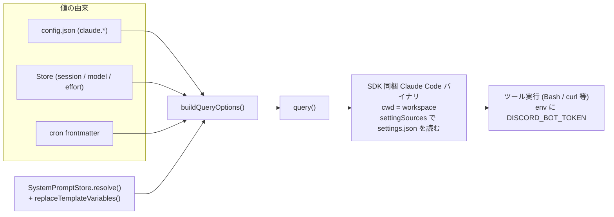

# Claude 連携

Claude Agent SDK (`@anthropic-ai/claude-agent-sdk`) の `query()` を呼び出す層の構造。`claude/mod.ts` の `askClaude()` / `buildQueryOptions()` が `query()` に渡すオプションの組み立てとエラー処理を担い、`claude/system-prompt.ts` の `SystemPromptStore` と `claude/template.ts` の `replaceTemplateVariables()` が preset システムプロンプトへ append する文字列を作る。呼び出し側は chat (`bot/mod.ts`) と cron (`cron/executor.ts`) の 2 箇所。

関連: [README](README.md) / [message-flow](message-flow.md) / [cron](cron.md) / [store-and-settings](store-and-settings.md) / [approval](approval.md) / [deployment](deployment.md)

## 全体像

## askClaude()

`claude/mod.ts` の `askClaude(prompt, options)` は `AsyncGenerator<SDKMessage>` を返し、`query()` が返す `SDKMessage` をそのまま逐次 yield する。消費側は `message.type` で分岐する。

- 引数 `options` は `ClaudeCallOptions` (`sessionId` / `appendSystemPrompt` / `model` / `effort` / `canUseTool` / `discordToken`) に `config: ClaudeConfig`、`signal?: AbortSignal`、`queryFn?: QueryFn` を加えたもの。
- `signal` は内部で生成した `AbortController` に橋渡しされる (既に aborted なら即 abort、そうでなければ `abort` イベントで abort)。`askClaude()` 自身はタイムアウトを持たず、呼び出し側が `AbortSignal.timeout(...)` を渡す (chat は `config.claude.timeout`、cron は frontmatter の `timeout` があればそれ、無ければ `config.claude.timeout`)。
- `queryFn` は `typeof query` の DI。省略時は SDK の `query`。テストではモックの `AsyncGenerator<SDKMessage>` を返す関数を注入する。
- セッション不在時の再試行: 最初の試行が何も yield せずに失敗し、エラーメッセージが `isSessionNotFoundError()` (`"No conversation found with session ID"` を含む) に一致し、`sessionId` が指定されていた場合に限り、`resume` を外して 1 回だけやり直す。既に 1 件でも yield 済みなら再試行しない (下流の二重出力を防ぐ)。新しい `session_id` は消費側が `result` イベントから保存し直す。
- それ以外の失敗: 受信したイベント種別の列 (`events received (N): ...`、0 件なら `query died before any output`) と最後のイベント (JSON を 2000 文字に切り詰め) を ERROR ログに残し、`claude query failed: <reason>` で rethrow する。

## buildQueryOptions()

`buildQueryOptions(config, opts, abortController)` が `query()` の `Options` を組み立てる。常に設定するものと、値があるときだけ設定するものがある。

| オプション               | 値の由来                                                                                                                             | 備考                                                                                                                                                                                                                                                    |
| ------------------------ | ------------------------------------------------------------------------------------------------------------------------------------ | ------------------------------------------------------------------------------------------------------------------------------------------------------------------------------------------------------------------------------------------------------- |
| `cwd`                    | `config.claude.cwd` (`config.ts` の `loadConfig()` が `Deno.cwd()` を注入。固定)                                                     | SDK 同梱バイナリの作業ディレクトリ = ワークスペース                                                                                                                                                                                                     |
| `maxTurns`               | `config.json` の `claude.maxTurns`。cron は frontmatter `maxTurns` があれば上書きした `ClaudeConfig` を渡す                          | 常に設定                                                                                                                                                                                                                                                |
| `abortController`        | `askClaude()` 内部生成 (呼び出し側の `signal` を橋渡し)                                                                              | 常に設定                                                                                                                                                                                                                                                |
| `settingSources`         | 固定 `["user", "project"]`                                                                                                           | ワークスペースの CLAUDE.md / skills / `.claude/settings.json` (`permissions.allow`) を読ませる。省略すると SDK の isolation mode で何も読まれない                                                                                                       |
| `includePartialMessages` | 固定 `true`                                                                                                                          | 消費側が `stream_event` (`text_delta` / `thinking_delta`) を受け取るために必要                                                                                                                                                                          |
| `env`                    | `{ ...Deno.env.toObject(), DISCORD_BOT_TOKEN? }`                                                                                     | SDK は `env` を渡すと process.env を継承しないため spread する (`CLAUDE_CONFIG_DIR` 等を失わない)。`opts.discordToken` (`config.discord.token`) があれば `DISCORD_BOT_TOKEN` として注入し、同梱バイナリが spawn する Bash/curl (`discord` skill) へ渡る |
| `systemPrompt`           | 固定 `{ type: "preset", preset: "claude_code" }` + `append: opts.appendSystemPrompt` (あれば)                                        | `append` は `SystemPromptStore.resolve()` の結果                                                                                                                                                                                                        |
| `resume`                 | `opts.sessionId` (Store の解決値。chat はスコープの session、cron は `resumeSession: true` のとき `cron:{name}` スコープの session)  | 値があるときのみ                                                                                                                                                                                                                                        |
| `model`                  | `opts.model` (chat は `Store.getModel(scope)`、cron は frontmatter `model` → チャンネルの Store 値 → `config.claude.defaults.model`) | 値があるときのみ                                                                                                                                                                                                                                        |
| `effort`                 | `opts.effort` を `normalizeEffort()` に通した値                                                                                      | `EFFORT_LEVELS` 外の値は捨てる。値があるときのみ                                                                                                                                                                                                        |
| `canUseTool`             | `createCanUseTool(approvalManager, channelId)` (`approval/manager.ts`)                                                               | 値があるときのみ。詳細は [approval](approval.md)                                                                                                                                                                                                        |

`buildQueryOptions()` が設定しないもの: `permissionMode`、`allowDangerouslySkipPermissions`、`allowedTools`、`mcpServers`、`hooks`、`agents`。ツール権限は `canUseTool` コールバックと、`settingSources` 経由で読まれる `.claude/settings.json` の `permissions.allow` だけで決まる。

### EFFORT_LEVELS と normalizeEffort()

`EFFORT_LEVELS` は `["low", "medium", "high", "xhigh", "max"] as const` で、型 `EffortLevel` はここから導出する。`normalizeEffort(effort?)` は空なら `undefined`、一覧にあればその値、それ以外は `unsupported effort level ignored: <値>` を WARN ログに出して `undefined` を返す。Store や frontmatter に不正な値が入っていても `query()` には渡らない。

## ストリームイベントのヘルパ

`claude/mod.ts` が消費側 (chat / cron) の重複を避けるために提供する純粋関数。

| 関数                                  | 役割                                                                                                                                                                                                                  |
| ------------------------------------- | --------------------------------------------------------------------------------------------------------------------------------------------------------------------------------------------------------------------- |
| `extractTopLevelTextDelta(event)`     | `type === "stream_event"` かつ `parent_tool_use_id` が falsy (トップレベル = サブエージェント以外) で、`event.event` が `content_block_delta` の `text_delta` なら `delta.text` を返す。それ以外は `undefined`        |
| `extractTopLevelThinkingDelta(event)` | 同条件で `delta.type === "thinking_delta"` なら `delta.thinking` を返す。thinking が流れるかは model / effort に依存する                                                                                              |
| `extractResultText(event)`            | `SDKResultMessage` の `result` が文字列ならそれを返す (`subtype` は問わない。`error_max_turns` 等でも `result` があれば採用)。無ければ `errors` または `subtype` から `claude returned error: <detail>` を throw する |

消費側の使い方 (chat のバッファリングとフラッシュ、cron の `result` のみ処理) は [message-flow](message-flow.md) と [cron](cron.md) を参照。

`claude/mod.ts` はさらに、chat (bot/mod.ts) と cron (`cron/executor.ts`) が個別に持っていた「`result` イベントの drain + 送信」を副作用ありの 2 関数に集約している。

| 関数                                                     | 役割                                                                                                                                                                                                                                       |
| -------------------------------------------------------- | ------------------------------------------------------------------------------------------------------------------------------------------------------------------------------------------------------------------------------------------ |
| `drainResultEvent(stream, { onNonSuccess, setSession })` | `SDKMessage` ストリームを走査し `result` イベントを拾う。非 success な `subtype` なら `onNonSuccess` を呼び、`setSession` があれば `event.session_id` で呼ぶ。ストリームを読み切った時点の `result` イベント (無ければ `undefined`) を返す |
| `sendResultText(resultEvent, send)`                      | `resultEvent` が無ければ `"claude stream ended without result event"` を throw する。あれば `extractResultText()` の結果を `send()` に渡す                                                                                                 |

cron は `drainResultEvent()` でストリーム全体を走査してから `sendResultText()` で送信する。chat (bot/mod.ts) は `text_delta` 等も同じループで処理する都合上、`result` イベントの捕捉自体は自前のループで行い、ストリーミングが一度も発生しなかった場合 (`hasStreamedText === false`) のフォールバックとして `sendResultText()` のみを呼ぶ。

## SystemPromptStore

`claude/system-prompt.ts` の `SystemPromptStore` は、ワークスペースの `{config.claude.cwd}/.claude/system-prompt/` 配下を起動時に読み込み、`query()` の `systemPrompt.append` に渡す文字列を組み立てる。`bot/mod.ts` の `DiscordBot` コンストラクタで生成し、`start()` の先頭で `load()` を呼ぶ。cron 側 (`CronExecutor`) にも同じインスタンスが渡る。

### load()

- `DEFAULT.md` / `CHAT.md` / `CRON.md` をそれぞれ読む (無ければ `undefined`。`trim()` して空なら `undefined`)。
- 同ディレクトリの残りの `*.md` を走査し、basename (拡張子除く) をキー、`trim()` 済み本文を値として `channelPrompts` (`Map<string, string>`) に入れる。thread と channel は同一 Snowflake 名前空間で衝突しないため、1 つの Map で両方を持つ。
- ディレクトリが無ければ INFO ログを出してスキップする。
- 結果はメモリにキャッシュされ、`resolve()` は I/O を伴わない。ファイル変更の反映には bot の再起動が必要。

### resolve(context, scope, vars)

`context` は `"chat" | "cron"`、`scope` は `{ channelId, threadId? }` (`PromptScope`、Store の `StoreScope` と同形)。

1. `DEFAULT.md` があれば含める
2. `context` に応じて `CHAT.md` または `CRON.md` があれば含める
3. スコープ別ファイルを 1 件だけ含める: `{threadId}.md` があればそれ、無ければ `{channelId}.md`、どちらも無ければスキップ。置き換えであって積み上げではない (`{threadId}.md` が選ばれたとき `{channelId}.md` は読まれない)
4. 採用したものを `"\n\n"` で結合し、`vars` があれば `replaceTemplateVariables()` で `{{key}}` を置換して返す。何も無ければ `undefined`

## テンプレート変数

`claude/template.ts` の `replaceTemplateVariables(template, vars)` は正規表現 `/\{\{([\w.]+)\}\}/g` で `{{key}}` を `vars[key]` に置換する。`vars` に無いキーはプレースホルダーのまま残る。

| 変数                       | chat での値 (`bot/mod.ts`)                                                           | cron での値 (`cron/executor.ts`)                     |
| -------------------------- | ------------------------------------------------------------------------------------ | ---------------------------------------------------- |
| `{{discord.guild.id}}`     | `config.discord.guildId`                                                             | `config.discord.guildId`                             |
| `{{discord.guild.name}}`   | `message.guild?.name ?? ""`                                                          | `client.guilds.cache` から引いた名前 (無ければ `""`) |
| `{{discord.channel.id}}`   | `localId` = `threadId ?? channelId` (発話があった場所)                               | 渡さない                                             |
| `{{discord.channel.name}}` | 発話があったチャンネル / スレッドの `name` (無ければ `""`)                           | 渡さない                                             |
| `{{discord.channel.type}}` | `"thread"` / `"text"`                                                                | 渡さない                                             |
| `{{discord.user.id}}`      | 発話者 ID。AI to AI 自己メンション起動時は `config.discord.userId` (認可ユーザー)    | 渡さない                                             |
| `{{discord.user.name}}`    | 発話者の `displayName`。自己メンション起動時は認可ユーザーの表示名 (取れなければ ID) | 渡さない                                             |

注意点:

- `{{discord.channel.id}}` / `{{discord.channel.name}}` はスレッド内の発話ではスレッドの ID / 名前になる。`{channelId}.md` がスレッド内でフォールバック採用された場合も同様。
- 自己メンション起動時に `{{discord.user.*}}` を認可ユーザーに差し替えるのは、「発話者へメンションせよ」という指示が `<@botId>` を生み連鎖の火種になるのを防ぐため。
- cron ではギルド変数のみ渡されるため、`CRON.md` にチャンネル / ユーザー変数を書くとプレースホルダーのまま残る。

## 呼び出し側の差分

| 項目                 | chat (`bot/mod.ts`)                                                                                                                                                                                                 | cron (`cron/executor.ts`)                                                                                                                   |
| -------------------- | ------------------------------------------------------------------------------------------------------------------------------------------------------------------------------------------------------------------- | ------------------------------------------------------------------------------------------------------------------------------------------- |
| `sessionId`          | `Store.getSession(scope)` (`scope` = `{ channelId: parentId or channelId, threadId? }`)                                                                                                                             | `resumeSession: true` のとき `Store.getSession({ channelId: "cron:{name}" })`。それ以外は `undefined`                                       |
| `signal`             | `AbortSignal.timeout(config.claude.timeout)`                                                                                                                                                                        | `AbortSignal.timeout(job.timeout ?? config.claude.timeout)`                                                                                 |
| `config`             | `config.claude`                                                                                                                                                                                                     | `config.claude` に frontmatter `maxTurns` を上書きしたコピー                                                                                |
| `appendSystemPrompt` | `systemPrompts.resolve("chat", scope, vars)`                                                                                                                                                                        | `systemPrompts.resolve("cron", { channelId: job.channelId ?? "" }, vars)`                                                                   |
| `model` / `effort`   | `Store.getModel(scope)` / `Store.getEffort(scope)` (thread → channel → `config.claude.defaults`)                                                                                                                    | frontmatter `model` / `effort` → `Store.getModel/getEffort({ channelId: job.channelId })` (channelId があるとき) → `config.claude.defaults` |
| `discordToken`       | `config.discord.token`                                                                                                                                                                                              | コンストラクタで受け取った `config.discord.token`                                                                                           |
| `canUseTool`         | `createCanUseTool(approvalManager, localId)`                                                                                                                                                                        | `createCanUseTool(approvalManager, job.channelId)` (省略可)                                                                                 |
| イベント消費         | `text_delta` / `thinking_delta` をバッファしてストリーミング投稿、`assistant` で強制フラッシュ、`tool_progress` で進捗表示、`result` で `session_id` を保存。`stream_event` が無ければ `extractResultText()` で補う | `result` のみ扱う。`resumeSession: true` なら `session_id` を保存し、`extractResultText()` の結果を `channelId` 指定時に投稿する            |

詳細は [message-flow](message-flow.md) と [cron](cron.md)。

## ワークスペース側の関連ファイル

| パス                                                                                         | 役割                                                                                                             |
| -------------------------------------------------------------------------------------------- | ---------------------------------------------------------------------------------------------------------------- |
| `data/workspace/.claude/system-prompt/DEFAULT.md` / `CHAT.md` / `CRON.md` / `{channelId}.md` | `SystemPromptStore` が読むシステムプロンプト。配置と内容は [deployment](deployment.md)                           |
| `data/workspace/.claude/settings.json`                                                       | `settingSources: ["user", "project"]` で同梱バイナリが読む。`permissions.allow` の扱いは [approval](approval.md) |
