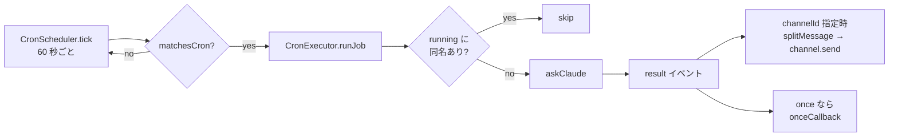

# 定期実行 (cron)

ワークスペース直下の `cron/*.md` (YAML フロントマター + 本文プロンプト) で定義したジョブを、bot プロセス内のスケジューラが分単位で評価し、マッチしたら `askClaude()` を実行して結果を Discord へ投稿する仕組み。`cron/` ディレクトリが存在しなければ cron 機能は無効になる (ジョブ 0 件でスケジューラだけが動く)。Claude Code 組み込みの `CronCreate` / `CronDelete` / `CronList` / `RemoteTrigger` とは無関係で、ジョブの管理はファイル操作と内部 HTTP API で行う。

関連: [README](README.md) / [lifecycle](lifecycle.md) / [claude-integration](claude-integration.md) / [store-and-settings](store-and-settings.md) / [approval](approval.md) / [internal-api](internal-api.md) / [deployment](deployment.md)

エージェント向けの書き方・運用手順 (reload の検証手順、`once` の注意、cron 式の例等) は `data/workspace/.claude/skills/cron/SKILL.md` に集約されている。本書は実装の構造と事実のみを扱い、手順は重複させない。

## 構成要素

| ファイル             | シンボル                                      | 役割                                                                            |
| -------------------- | --------------------------------------------- | ------------------------------------------------------------------------------- |
| `cron/types.ts`      | `CronJobDef`                                  | ジョブ定義の型。loader の出力、scheduler / executor の入力                      |
| `cron/match.ts`      | `parseCronExpression()` / `matchesCron()`     | 5 フィールド cron 式のパースとローカルタイムでのマッチ判定                      |
| `cron/loader.ts`     | `loadCronJobsFromDir()` / `validateCronJob()` | `cron/` 走査、フロントマター抽出、JSON Schema 検証                              |
| `cron/scheduler.ts`  | `CronScheduler`                               | 60 秒 tick で全ジョブを評価し、マッチしたジョブのコールバックを呼ぶ             |
| `cron/executor.ts`   | `CronExecutor`                                | scheduler を保持し、ジョブ 1 件の実行 (`askClaude()` → Discord 投稿) を担う     |
| `bot/mod.ts`         | `DiscordBot.start()`                          | `ClientReady` で executor を生成・起動し、reload / run / list を API へ配線する |
| `api/routes/cron.ts` | `createCronRoutes()` / `CronRouteContext`     | `GET /cron` / `POST /cron/run` / `POST /cron/reload`                            |

## 全体の流れ



## ジョブファイル

`cron/{name}.md`。ジョブ名はファイル名から `.md` を除いたもの (`validateCronJob()`)。フロントマターが `CronJobDef` のメタデータ、本文 (trim 後) がプロンプトになる。

最小例:

```markdown
---
schedule: "0 9 * * *"
channelId: "{channelId}"
---

今日の予定を要約して。
```

### フロントマターのフィールド

`cron/loader.ts` の `frontMatterSchema` (JSON Schema、`@cfworker/json-schema` で検証) が受け付けるキーは次のとおり。

| フィールド      | 必須 | 型                  | 既定                     | 説明                                                                                                               |
| --------------- | ---- | ------------------- | ------------------------ | ------------------------------------------------------------------------------------------------------------------ |
| `schedule`      | yes  | string (1 文字以上) | —                        | 5 フィールド cron 式。構造検証通過後に `parseCronExpression()` で構文を別途検証する。評価は TZ 依存 (後述)         |
| `channelId`     | no   | string \| number    | —                        | 結果の投稿先、かつ承認ボタン / `AskUserQuestion` の送信先。`String()` で文字列化して保持。省略時は結果を投稿しない |
| `resumeSession` | no   | boolean             | `false`                  | `true` のときだけ前回セッションを resume する                                                                      |
| `maxTurns`      | no   | number              | `config.claude.maxTurns` | `ClaudeConfig.maxTurns` のオーバーライド                                                                           |
| `timeout`       | no   | number (ms)         | `config.claude.timeout`  | `askClaude()` に渡す `AbortSignal.timeout()` のミリ秒                                                              |
| `once`          | no   | boolean             | `false`                  | `true` なら 1 回実行後 (成否を問わず) にジョブファイルを削除して reload する                                       |
| `model`         | no   | string              | —                        | モデル alias / full name のオーバーライド                                                                          |
| `effort`        | no   | string (enum)       | —                        | `claude/mod.ts` の `EFFORT_LEVELS` (`low` / `medium` / `high` / `xhigh` / `max`) のいずれか                        |

- `additionalProperties: false` のため、上記以外のキー (typo 等) は検証エラーになる。ファイル単位の失敗として扱われるため、当該ジョブだけが loader (下記) でスキップされ、他のジョブの読み込みは続く。
- 本文が空 (trim 後に空文字) のファイルは検証エラーになる (`prompt body is empty`)。
- `channelId` は YAML で引用符なしに書くと数値として読まれるため、型は `string | number` の `oneOf` で受け、`CronJobDef.channelId` へは文字列として格納する。

## loader (`cron/loader.ts`)

`loadCronJobsFromDir(workspaceDir)` は `join(workspaceDir, "cron")` を `Deno.readDir()` で走査し、`.md` のファイルだけを対象にする。各ファイルは `@std/front-matter/yaml` の `extract()` で `attrs` / `body` に分け、`validateCronJob(attrs, body.trim(), filename)` で `CronJobDef` に変換する。

- ディレクトリが無い (`Deno.errors.NotFound`) 場合は INFO ログを出して空配列を返す。それ以外の読み取りエラーは throw する。
- ファイル単位の失敗 (YAML 構文エラー、スキーマ不適合、cron 式の構文エラー、本文空) は `cron-loader` 名前空間に ERROR ログを出してそのファイルを skip し、残りのファイルの読み込みを続ける。このため `POST /cron/reload` はファイルの失敗があっても `{ "ok": true }` を返す (reload の戻りは登録の成否を表さない)。登録結果の確認手順は cron skill と [internal-api](internal-api.md) を参照。
- `validateCronJob()` はスキーマ不適合時に `@cfworker` のエラーを人間向けメッセージ (`"schedule" is required and must be a non-empty string` 等) に変換し、複数のエラーを `"; "` で連結して 1 つの `Error` として throw する (`shortCircuit: false` で全エラーを収集)。

## match (`cron/match.ts`)

標準 5 フィールド (分 時 日 月 曜日) の cron 式を扱う。

- 各フィールドは `*`、`N`、`N-M`、`X/step` (`X` は `*` / `N` / `N-M`)、およびそれらのカンマ区切りリストをサポートする。`N/step` は `N` からそのフィールドの最大値まで `step` 刻み。
- 有効範囲は分 0-59、時 0-23、日 1-31、月 1-12、曜日 0-7。曜日の 7 は 0 (日曜) に正規化される。範囲外の値、`start > end` の範囲、1 未満または非整数の step は構文エラーとして throw する。
- `parseCronExpression()` の結果はモジュールレベルの `Map` にキャッシュされる (同じ式を毎分評価するため)。
- `matchesCron(expression, now?)` は `now` 省略時に `Temporal.Now.zonedDateTimeISO()` を使い、システムのタイムゾーン (コンテナでは compose が渡す `TZ`) で評価する。Temporal の `dayOfWeek` (1=月 .. 7=日) は `% 7` で 0=日 .. 6=土 に変換して比較する。

## scheduler (`cron/scheduler.ts`)

`CronScheduler` はコンストラクタでコールバック `(job: CronJobDef) => void` を受け取り、`setInterval` ベースで動く。

- `TICK_INTERVAL_MS = 60_000`。`start()` は現在時刻から次の分境界までの残り ms を `setTimeout` で待ってから最初の `tick()` を実行し、その後 `setInterval` で 60 秒ごとに `tick()` を回す。既に開始済みなら何もしない。
- `tick(now?)` は `epochMilliseconds / TICK_INTERVAL_MS` の floor を分キーとして `lastTickMinute` と比較し、同一分なら何もしない (二重発火ガード)。その後、登録済みの全ジョブについて `matchesCron(job.schedule, zdt)` を評価し、マッチしたジョブごとにコールバックを呼ぶ。
- ジョブ 1 件の評価で例外が出ても `try / catch` で ERROR ログに落とし、他のジョブの評価を続ける (ジョブ単位のエラー隔離)。コールバックは戻り値を待たずに呼ぶため、executor の非同期処理は tick をブロックしない。
- `replaceAll(jobs)` は内部の `Map<name, CronJobDef>` を丸ごと差し替える。タイマーは維持されるため、実行中のスケジューラに対するホットスワップになる。`stop()` はアライン用 `setTimeout` と `setInterval` を両方止め、`lastTickMinute` をリセットする。
- `getJob(name)` / `getAllJobs()` / `size` を公開し、executor の `findJob()` / `listJobs()` がこれを使う。

## executor (`cron/executor.ts`)

`CronExecutor` は `CronScheduler` を内部に持ち、コンストラクタで discord.js `Client`、`ClaudeConfig`、ギルド ID、bot トークン、`Store`、`ClaudeDefaults`、`ApprovalManager`、`SystemPromptStore`、任意の `queryFn` (テスト用 DI) を受け取る。`start(jobs)` は `replaceAll` → `scheduler.start()`、`reload(jobs)` は `replaceAll` のみ (実行中のジョブはそのまま完了し、次の tick から新定義が効く)、`stop()` は `scheduler.stop()`。`isRunning(name)` は並行実行ガード (`running: Set<string>`) の状態を読む公開メソッドで、テストから使う。

`runJob(job)` が 1 件の実行本体で、スケジューラのコールバックと `POST /cron/run` の両方から呼ばれる。

1. 並行実行ガード: `running: Set<string>` に同名ジョブがあれば WARN ログを出して return する。無ければ追加する。このガードはジョブ名単位であり、別名ジョブは同一 tick で同時に起動する。news-* 6 本は 8:00 に揃えて同時起動させている (2026-08-23 に 10 分刻みへ分散したが、分散前 (2026-08-23 以前) の同時起動でも負荷集中は見られなかったため 2026-08-29 に 8:00 へ戻した)。負荷集中が問題になる場合はジョブ定義側で `schedule` をずらす。
2. チャンネルの事前取得: `job.channelId` があれば `client.channels.fetch()` し、`send` を持たなければ throw する。事前に取るのは、後段の catch でエラー通知先として使うため。
3. KV の読み取り (3 つを `Promise.all` で並列):
   - session: `resumeSession` が true のときだけ `store.getSession({ channelId: "cron:{name}" })`。false なら `undefined` (毎回新規セッション)。
   - model / effort: `job.channelId` があるときだけ `store.getModel({ channelId: job.channelId })` / `store.getEffort({ channelId: job.channelId })`。つまり **投稿先チャンネルのスコープ設定** を読む (`cron:{name}` スコープではない)。`channelId` 省略時はどちらも `undefined`。
   - 解決順は `job.model ?? channelModel ?? defaults.model`、effort も同様 (frontmatter → チャンネル設定 → `config.claude.defaults`)。いずれも無ければ `askClaude()` に渡さず、SDK 既定に任せる。スコープ解決の一般論は [store-and-settings](store-and-settings.md)。
4. システムプロンプト: `systemPrompts.resolve("cron", { channelId: job.channelId ?? "" }, templateVars)`。`templateVars` はギルドレベルのみ (`discord.guild.id` / `discord.guild.name`) で、チャンネル / ユーザー変数は展開されずプレースホルダのまま残る。context が `"cron"` なので `DEFAULT.md` + `CRON.md` に加え、`job.channelId` と同名の `{channelId}.md` があればそれも結合される (スレッドは無いので thread フォールバックは起きない)。詳細は [claude-integration](claude-integration.md)。
5. 設定の組み立て: `jobConfig` は `ClaudeConfig` を spread でコピーし、`job.maxTurns` が指定されていれば `maxTurns` だけ上書きする。`timeout = job.timeout ?? config.timeout`。
6. `askClaude(job.prompt, { sessionId, config: jobConfig, discordToken, signal: AbortSignal.timeout(timeout), appendSystemPrompt, model, effort, canUseTool: createCanUseTool(approvalManager, job.channelId), queryFn })` を呼ぶ。`canUseTool` に渡す `channelId` は `job.channelId` で、省略時は `undefined` となり `ApprovalManager` は自動 deny する (共有状態へのフォールバックは無い)。承認フローは [approval](approval.md)。
7. ストリーム消費: `drainResultEvent(stream, { onNonSuccess, setSession })` (`claude/mod.ts`) で `for await` を回し、`event.type === "result"` イベントごとに `handleResultEvent()` (非 success なら `onNonSuccess` で WARN ログ、`setSession` があれば `event.session_id` で呼ぶ) を呼び、最後の `result` イベントを返す。`text_delta` / `thinking_delta` / `tool_progress` は読まない (ストリーミング投稿・進捗表示・thinking 表示は無い)。`resumeSession` が true なら `setSession` から `store.setSession({ channelId: "cron:{name}" }, newSessionId)` で保存する。
8. `requireResultText(resultEvent)` (`claude/mod.ts`) で本文を取り出す。`result` 無しで終わっていたら `claude stream ended without result event` を throw する (`textChannel` の有無に関わらず、この呼び出しがコード上先に評価されるため必ず throw される)。取り出せたら `textChannel` があるときだけ `splitMessage()` で 2000 文字に分割して `channel.send()` する (`channelId` 省略時は投稿しない。プロンプト側で Discord REST API を叩く設計にする)。
9. catch: ERROR ログ (`cron job "{name}" failed:`、全文) を出し、`textChannel` が取得済みなら `[cron: {name}]` + `summarizeErrorForDiscord(error)` (`errors.ts`、定型文 + エラーメッセージの先頭 1 行を要約したもの) を送る。通知自体の失敗は握りつぶす。
10. finally: `job.once` かつ `onceCallback` が設定されていれば `onceCallback(job.name)` を await する (失敗はログのみ)。最後に `running` から削除する。

`askClaude()` / `drainResultEvent()` / `requireResultText()` は chat と共通で、cron 固有の分岐は持たない ([claude-integration](claude-integration.md))。

### セッションとスコープ

| 項目                   | スコープ                                              | 備考                                                                                |
| ---------------------- | ----------------------------------------------------- | ----------------------------------------------------------------------------------- |
| session                | `{ channelId: "cron:{name}" }`                        | `resumeSession: true` のときのみ get / set。既定 (`false`) では KV を読み書きしない |
| model / effort         | `{ channelId: job.channelId }`                        | `channelId` 省略時は読まず `defaults` へ                                            |
| システムプロンプト     | `{ channelId: job.channelId ?? "" }` (context `cron`) | `{channelId}.md` が cron 実行にも適用される                                         |
| 承認 / AskUserQuestion | `job.channelId`                                       | 省略時は `undefined` となり自動 deny (共有状態へのフォールバックは無い)             |

## 起動と API の配線 (`bot/mod.ts`)

`DiscordBot.start()` の `ClientReady` ハンドラ内で、スラッシュコマンド登録の後に次を行う。起動順全体は [lifecycle](lifecycle.md)。

1. `new CronExecutor(client, config.claude, config.discord.guildId, config.discord.token, store, config.claude.defaults, approvalManager, systemPrompts)`。
2. `loadCronJobsFromDir(config.claude.cwd)` → `cronExecutor.start(jobs)`。`config.claude.cwd` はワークスペースルート (本番は `/data/workspace`、devcontainer では `/app`。[deployment](deployment.md))。
3. `reloadJobs = () => loadCronJobsFromDir(cwd) → cronExecutor.reload(jobs)` を定義する。
4. `cronExecutor.setOnceCallback()` で once 後処理を登録する: `join(cwd, "cron", "{name}.md")` を `Deno.remove()` し (失敗は ERROR ログ)、続けて `reloadJobs()` を呼ぶ。エージェント側の手動 reload は不要。
5. `runJobByName(name)`: `cronExecutor.findJob(name)` が無ければ `job not found: {name}` を throw、あれば `runJob(job)` を await する。
6. `CronRouteContext { reloadCronJobs: reloadJobs, runJob: runJobByName, listJobs: () => cronExecutor.listJobs() }` を `startApiServer(config.claude.apiPort, settingsCtx, healthCtx, cronCtx)` に渡す。

`shutdown()` では最初に `cronExecutor.stop()` を呼ぶ。

`/claw settings show` (`bot/commands.ts` の `handleSettingsShow()`) は `cronExecutor.listJobs()` を使って登録済みジョブ名とスケジュールを一覧表示する。

### HTTP エンドポイント (`api/routes/cron.ts`)

`createCronRoutes(ctx)` が Hono サブアプリを返し、`api/server.ts` が `/cron` にマウントする。`ctx` の各関数が未注入なら 503 (`cron not available` / `cron reload not available`) を返す。リクエスト / レスポンスの正は `docs/api/paths/cron*.yaml` と、そこから生成した `api/internal-schemas.ts`。詳細は [internal-api](internal-api.md)。

| エンドポイント      | 入力               | 出力                                                                              |
| ------------------- | ------------------ | --------------------------------------------------------------------------------- |
| `GET /cron`         | —                  | `{ jobs: [{ name, schedule, channelId?, once }] }` (`channelId` は未指定なら省略) |
| `POST /cron/run`    | `{ name: string }` | `{ ok: true, name }`。`name` 不正は 400、未登録は 404 (`job not found: ...`)      |
| `POST /cron/reload` | —                  | `{ ok: true }` (ファイル単位の読み込み失敗があっても 200)                         |

`POST /cron/run` は `runJob()` の完了まで await するため、レスポンスはジョブの実行が終わってから返る。実行中の同名ジョブがあればガードにより skip され、その場合も 200 が返る。

## 利用規約との関係

`docs/terms-of-service.md` にあるとおり、サブスクリプションの使用量上限は「個人の通常利用 (ordinary, individual usage)」を前提にしている。cron はこの前提の中で最も機械的にトークンを消費する経路なので、ジョブの本数・スケジュールの頻度・`maxTurns` をその範囲に保つことがこのモジュールの不変条件になる。詳細は [docs/terms-of-service.md](../terms-of-service.md) の「サブスクリプションプランでの Agent SDK 利用」節を参照。
