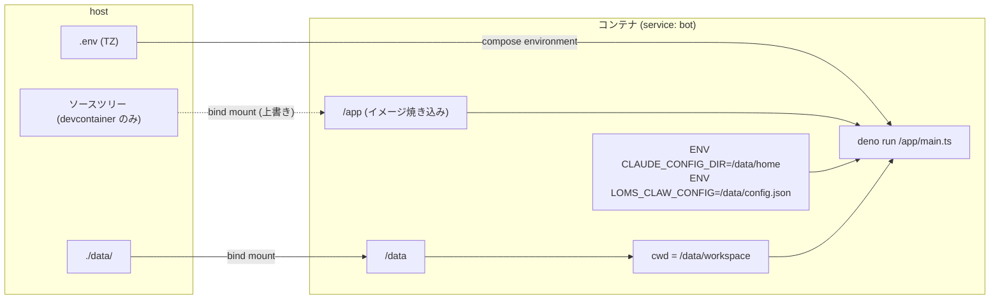

# デプロイと workspace

loms-claw を Docker コンテナとして動かすための構成 (Dockerfile / compose.yaml / devcontainer) と、コンテナに bind mount する実行時データ `data/` のレイアウト、その中のエージェントワークスペース `data/workspace/` の構成をまとめる。正はリポジトリの実ファイルであり、本文で挙げる事実はそれぞれのファイルで確認できる範囲に限る。

関連: [README.md](README.md) / [lifecycle.md](lifecycle.md) / [claude-integration.md](claude-integration.md) / [store-and-settings.md](store-and-settings.md) / [approval.md](approval.md) / [cron.md](cron.md) / [internal-api.md](internal-api.md)

## 全体像



## Dockerfile

`Dockerfile` はリポジトリルートに置く。

- ベースイメージは `docker.io/denoland/deno:debian-2.9.5` (Debian ベースの glibc イメージ)。
- `ENV CLAUDE_CONFIG_DIR=/data/home`: Claude Code の設定・認証情報の置き場所を既定の `~/.claude` から bind mount 先へ置き換える。
- `ENV LOMS_CLAW_CONFIG=/data/config.json`: `config.ts` の `loadConfig()` が読む設定ファイルのパス。未設定時の既定は `./data/config.json`。
- apt で `ca-certificates curl git jq bubblewrap socat ffmpeg tzdata` を入れる。Dockerfile のコメントに用途を 1 行ずつ記載している。
  - `ca-certificates`: `curl` / Agent SDK 同梱バイナリの TLS 検証。
  - `curl` / `jq`: workspace の skill (`discord` 等) が REST API を叩く手段。`compose.yaml` の healthcheck でも使う。
  - `git`: Claude Code (同梱バイナリ) がリポジトリ操作・文脈取得に使う。
  - `bubblewrap` / `socat`: Agent SDK 同梱 Claude Code のサンドボックス機能が使う。`@anthropic-ai/claude-agent-sdk@0.3.232` の `sdk.mjs` に `bwrapPath` / `socatPath` という設定項目があることで確認済み。
  - `ffmpeg`: `bot/message.ts` の `resizeImageIfNeeded()` が画像添付の縮小に `Deno.Command("ffmpeg", ...)` で呼ぶ。`bluesky` skill も画像リサイズに使う。
  - `tzdata`: compose から渡す `TZ` を解決するため。
- `WORKDIR /app` で `deno.json` / `deno.lock` をコピーし `deno install` を実行する。続けて Agent SDK が同梱する Claude Code バイナリ (`@anthropic-ai/claude-agent-sdk-linux-{x64,arm64}`) を `/usr/local/bin/claude` へ symlink する。Dockerfile のコメントによれば、この symlink は初回認証 `claude auth login` 等の手動操作用で、実行時の `query()` は SDK がバイナリを自動解決する。アーキテクチャは `dpkg --print-architecture` で判定し、`amd64` / `arm64` 以外はビルド失敗にする。
- glibc イメージでは使われない musl 用バイナリ (`claude-agent-sdk-linux-*-musl/*/claude`) を削除する。Dockerfile のコメントによれば、パッケージディレクトリごと消すと deno が起動時に再ダウンロードするため、バイナリファイルのみ削除する。
- `COPY . .` でソースツリー全体を `/app` に焼き込む (除外は `.dockerignore`)。
- 最後に `WORKDIR /data/workspace` とし、`CMD ["deno", "run", "--allow-env", "--allow-sys", "--allow-ffi", "--allow-read", "--allow-write", "--allow-net", "--allow-run", "/app/main.ts"]` で起動する。Dockerfile のコメントによれば、`deno task` は `deno.json` のあるディレクトリを cwd にするためここでは使えず、権限フラグは `deno.json` の `start` タスクと手動で揃える。同期を自動化する仕組み (CI での突合、`deno task --cwd /app start` への置き換え等) は導入しておらず、コメントによる手動同期を現状維持する ([#129](https://github.com/ansanloms/loms-claw/issues/129))。
- multi-stage build は評価の上で見送った (単一ステージを維持)。`deno install` 専用の builder ステージを切り、実行ステージで `DENO_DIR` と `claude` symlink のみ `COPY --from` する構成を検証したところ、単一ステージ (`docker build` 時点で 1.09GB) に対し multi-stage は 1.42GB と約 30% 大きくなった。単一ステージは `deno install` と musl バイナリ削除を同一レイヤーで行うため無駄なレイヤーが残らない一方、multi-stage は builder ステージで構築した `DENO_DIR` (npm キャッシュ全体) を `COPY --from` で丸ごと複製するコストがレイヤー節約分を上回った ([#124](https://github.com/ansanloms/loms-claw/issues/124))。

### .dockerignore

`.dockerignore` は次を実行イメージのビルドコンテキストから除外する。

- `data` (実行時データ。機密を含み、実行時に `/data` へ bind mount される)、`.env`、`.git`、`.claude`、`coverage`
- `docs/`、`README.md`、`LICENSE`、`**/*.test.ts`、`.github/`、`compose.yaml` (実行時に不要で、`deno task generate` 等の開発時のみ使うファイル群)

## compose.yaml

`compose.yaml` はリポジトリルートに置き、compose のコマンドはすべてリポジトリルートで実行する。

| 項目           | 内容                                                                                                                                                                                                                                                  |
| -------------- | ----------------------------------------------------------------------------------------------------------------------------------------------------------------------------------------------------------------------------------------------------- |
| プロジェクト名 | `loms-claw`                                                                                                                                                                                                                                           |
| サービス       | `bot` (`build: .`)                                                                                                                                                                                                                                    |
| environment    | `TZ: ${TZ:-Asia/Tokyo}` のみ。値は host の `.env` から compose が読む                                                                                                                                                                                 |
| volumes        | `./data` → `/data` の bind mount 1 つ                                                                                                                                                                                                                 |
| healthcheck    | `curl -fsS http://127.0.0.1:$(jq -r .claude.apiPort ${LOMS_CLAW_CONFIG:-/data/config.json})/health` (`interval: 60s` / `timeout: 10s` / `retries: 3` / `start_period: 60s`)。エンドポイント本体は [internal-api.md](internal-api.md) の `GET /health` |
| restart        | `unless-stopped`                                                                                                                                                                                                                                      |

`.env` は docker compose が host 側で参照する変数 (現状 `TZ` のみ) を持つファイルで、アプリ自体は `.env` を読まない (`.env.example` のコメント)。`.env` は `.gitignore` で管理外。

`extra_hosts: host.docker.internal:host-gateway` は #113 で VC (ボイスチャンネル) 機能を削除した際に唯一の参照元が無くなり、リポジトリ内に消費者が無い状態になっていたため削除した ([#129](https://github.com/ansanloms/loms-claw/issues/129))。

マウント先を変える等の調整は `compose.override.yaml` で行う。これは任意のファイルで、リポジトリでは追跡していない。

### healthcheck と再起動

`healthcheck:` を追加したことで `docker compose ps` / `docker inspect` に unhealthy 状態が反映されるようになるが、**docker compose 単体では unhealthy になってもコンテナは自動再起動しない** (`restart: unless-stopped` の restart policy は健全性を見ず、プロセスの exit code のみを見る)。`main.ts` は `unhandledrejection` / `error` を `preventDefault()` で握りつぶすため、Discord Gateway が切断されたままでもプロセス自体は生き続け、restart は働かない。unhealthy 検知から実際の再起動まで求めるなら、次のいずれかが別途必要になる。

- autoheal 系サイドカー ([`willfarrell/autoheal`](https://github.com/willfarrell/docker-autoheal) 等)。`docker.sock` のマウントを伴う。
- アプリ側で Gateway 切断が一定時間続いたら自ら `Deno.exit()` する watchdog。

どちらを採用するかは本 PR の対象外とし、別途判断する。

### 運用コマンド

```bash
docker compose build                 # ビルド
docker compose run --rm -it bot bash # 初回認証 (コンテナ内で claude auth login を実行して exit)
docker compose up -d                 # 本番起動
docker compose down                  # 本番停止
docker compose logs -f               # ログ確認
```

## devcontainer

`.devcontainer/` は本番と同じイメージ・compose 定義に、ソースツリーの bind mount を重ねただけの構成。

- `.devcontainer/devcontainer.json`: `dockerComposeFile` に `../compose.yaml` と `./compose.yaml` の 2 つを順に指定し、`service` は `bot`、`workspaceFolder` は `/app`、`overrideCommand: true`。VS Code 向けに `denoland.vscode-deno` 拡張と `deno.enable: true` を設定する。
- `.devcontainer/compose.yaml`: サービス `bot` に、リポジトリルート (`.`、相対パスは最初に指定した compose ファイルの場所基準) を `/app` へ重ねる bind mount を追加し、`restart: "no"` にする。コメントによれば、編集が即コンテナに反映されて `deno task dev` の `--watch` が拾い、起動・停止は devcontainer が管理する。

この構成から次が言える。

- 本番と同じ compose プロジェクト (`loms-claw`) とサービス (`bot`) を使うため、devcontainer を起動すると本番の bot コンテナは置き換わる。開発を終えたら `docker compose up -d` で本番構成に戻す。
- 設定は本番と同じ `/data/config.json` (イメージの `ENV LOMS_CLAW_CONFIG`) を読む。
- `deno task dev` は `deno.json` のあるディレクトリ (`/app`) を cwd に実行されるため、開発時のエージェントワークスペース (`query()` の `cwd`、`storePath` の基準) はソースリポジトリ自身になる。本番の cwd は `/data/workspace`。

## 環境変数

| 変数                | 供給元                                                                                                            | 消費者                                                                                                                                                                   |
| ------------------- | ----------------------------------------------------------------------------------------------------------------- | ------------------------------------------------------------------------------------------------------------------------------------------------------------------------ |
| `CLAUDE_CONFIG_DIR` | Dockerfile の `ENV` (`/data/home`)                                                                                | Claude Code (既定の `~/.claude` を置き換える)                                                                                                                            |
| `LOMS_CLAW_CONFIG`  | Dockerfile の `ENV` (`/data/config.json`)                                                                         | `config.ts` の `loadConfig()` (未設定時 `./data/config.json`)。`compose.yaml` の `healthcheck:` もこの値 (既定 `/data/config.json`) から `jq` で `claude.apiPort` を読む |
| `TZ`                | host の `.env` → `compose.yaml` の `environment` (`${TZ:-Asia/Tokyo}`)                                            | コンテナ全体 (cron 式のローカルタイム評価等)                                                                                                                             |
| `DISCORD_BOT_TOKEN` | bot プロセスが `config.discord.token` を `query()` の `env` に注入する (`claude/mod.ts` の `buildQueryOptions()`) | SDK 同梱バイナリが spawn する Bash/curl。`discord` skill が `Authorization: Bot ${DISCORD_BOT_TOKEN}` で使う                                                             |

`buildQueryOptions()` は `Deno.env.toObject()` を展開した上で `DISCORD_BOT_TOKEN` を足して `env` に渡す (SDK は `env` を指定すると `process.env` を継承しないため)。

## data/ ディレクトリ

実行時データは host の `data/` に集約し、丸ごとコンテナの `/data` へ bind mount する (マウントはこの 1 つだけ)。パスは host / コンテナで共通。

| パス                       | 用途                                                                   | 追跡状態 (`.gitignore`)                                                                                                                                                           |
| -------------------------- | ---------------------------------------------------------------------- | --------------------------------------------------------------------------------------------------------------------------------------------------------------------------------- |
| `data/config.json`         | アプリ設定。`data/config.json.example` をコピーして作成する            | 管理外                                                                                                                                                                            |
| `data/config.json.example` | 設定ファイルの雛形。先頭に `"$schema": "../config.schema.json"` を持つ | 追跡                                                                                                                                                                              |
| `data/home/`               | Claude Code の設定・認証情報 (`CLAUDE_CONFIG_DIR`)                     | `data/home/*` は管理外。`.gitkeep` のみ追跡                                                                                                                                       |
| `data/workspace/`          | エージェントワークスペース。本番の cwd                                 | `data/workspace/*` は管理外。`.claude/`、`CLAUDE.md`、`cron/` を `!` で除外解除して追跡する。`apm.yml` / `apm.lock.yaml` / `.gitignore` / `.gitkeep` は既に追跡されているため残る |

`.gitignore` はこのほか `**/*.kv` / `**/*.kv-shm` / `**/*.kv-wal` (Deno KV。コメントによれば `storePath` 既定値が cwd 基準のため、ローカル実行ではリポジトリ直下の `.claude/` にも作られる)、`**/apm_modules/`、`**/.claude/settings.local.json`、`.env`、`coverage/` を管理外にし、`!**/.gitkeep` で `.gitkeep` は残す。

### cwd と KV ファイルの位置

`config.schema.json` の `storePath` は既定 `.claude/loms-claw.kv` で、相対パスは cwd 基準 (`main.ts` が `Deno.openKv(config.storePath)` で開く)。

- 本番 (cwd `/data/workspace`): `/data/workspace/.claude/loms-claw.kv`。
- ローカル実行 (`deno task start`、cwd はリポジトリ直下): リポジトリ直下の `.claude/loms-claw.kv`。

`data/config.json.example` の `storePath` 値は `loms-claw.kv` で、schema の既定値 `.claude/loms-claw.kv` とは異なる。

## workspace の構成 (`data/workspace/`)

本番でエージェントの cwd になるディレクトリ。Claude Code の project-scoped な設定 (`.claude/`) とエージェント向けの指示書をここに置く。

| パス                        | 内容                                                                                                                                                                          | 追跡   |
| --------------------------- | ----------------------------------------------------------------------------------------------------------------------------------------------------------------------------- | ------ |
| `CLAUDE.md`                 | エージェント向け指示書。見出しは「振る舞い」「定期実行(cron)について」「チャンネル / スレッド設定 (`/claw settings`)」「Discord 操作」「AI to AI 自己メンション」「ログ参照」 | 追跡   |
| `.claude/rules/*.md`        | エージェントに常時読み込ませるルール (下表)                                                                                                                                   | 追跡   |
| `.claude/system-prompt/`    | `DEFAULT.md` / `CHAT.md` / `CRON.md` と、チャンネル ID 名のファイルが 1 件。結合の仕組みは [claude-integration.md](claude-integration.md)                                     | 追跡   |
| `.claude/settings.json`     | `permissions.allow` の置き場。承認フローとの関係は [approval.md](approval.md)                                                                                                 | 追跡   |
| `.claude/skills/`           | skill 12 本 (下記)                                                                                                                                                            | 追跡   |
| `cron/`                     | 定期実行ジョブファイル。書式と実行は [cron.md](cron.md)                                                                                                                       | 追跡   |
| `apm.yml` / `apm.lock.yaml` | APM の依存定義とロック                                                                                                                                                        | 追跡   |
| `.gitignore`                | workspace 内の管理外定義 (`memory/`、`apm_modules/`)                                                                                                                          | 追跡   |
| `memory/`                   | エージェントのファイルベース永続メモリ (個人データ)                                                                                                                           | 管理外 |
| `loms-claw.kv*`             | Deno KV (`storePath` 既定値の場合は `.claude/` 配下)                                                                                                                          | 管理外 |
| `apm_modules/`              | APM が取得したモジュール                                                                                                                                                      | 管理外 |

### `.claude/rules/`

| ファイル              | 役割 (先頭見出し)                                      |
| --------------------- | ------------------------------------------------------ |
| `discord-markdown.md` | Discord に送信するメッセージで使える書式・使えない書式 |
| `memory.md`           | `memory/` 配下のファイルベース永続メモリの管理         |
| `soul.md`             | 人格                                                   |
| `todo.md`             | `memory/TODO.md` による TODO 管理                      |
| `user.md`             | 応答するユーザのプロフィール                           |

### `.claude/skills/`

12 本のうち 8 本は `apm.yml` の `dependencies.apm` に `ansanloms/skills/<name>` として列挙されており、`apm.lock.yaml` にそれぞれのエントリを持つ。残り 4 本は `apm.yml` に無く、このリポジトリで直接管理する。

| 区分                    | skill                                                                                                                                    |
| ----------------------- | ---------------------------------------------------------------------------------------------------------------------------------------- |
| `apm.yml` に列挙 (8 本) | `find-docs`, `yamareco`, `discord`, `jartic-traffic-jam-forecast`, `jartic-traffic-volume`, `bluesky`, `news-digest`, `mountain-weather` |
| ローカル管理 (4 本)     | `cron`, `logs`, `settings`, `travel-note`                                                                                                |

## .worktreeinclude

`.worktreeinclude` は、開発者ローカルで git worktree を作るときに `git-worktree-include` がメイン worktree から新しい worktree へ複製するローカル資産の一覧 (gitignore 構文)。コメントによれば、`data/` 配下の実行時データは本番からメイン worktree の `data/` へ同期したものを正とし、各 worktree はそこから複製する。列挙されているのは次の 4 つ。

- `.env` (docker compose が host 側で読む env。存在する場合のみ)
- `data/config.json` (ローカル実行用に調整した config)
- `data/home/` (Claude の設定・認証情報)
- `data/workspace/` (エージェントワークスペース)

## dependabot と GitHub Actions

- `.github/dependabot.yml` は 4 エントリ: `deno` (`/`)、`deno` (`/docs/api`。独自の `deno.json` / `deno.lock` を持ちルートから参照されないため分けている)、`docker` (`/`)、`github-actions` (`/`)。いずれも週次 (月曜 07:00 Asia/Tokyo)。deno の 2 エントリは minor / patch を `minor-and-patch` グループにまとめ、コミットメッセージの prefix は deno / docker が `build`、github-actions が `ci`。
- `.github/workflows/claude.yml` は issue / PR のコメント・レビュー・issue 作成で `@claude` を含むときに `anthropics/claude-code-action@v1` を実行するワークフローのみ。テスト・lint・型チェックを回す CI ワークフローは無い (PR 前の検証チェーンはローカルで実行する。`.claude/rules/pr.md`)。
