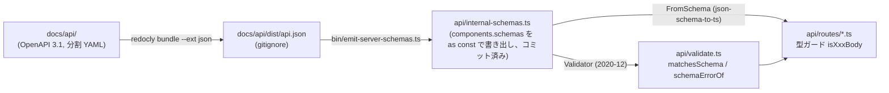

# 内部 HTTP API

bot プロセス内で `127.0.0.1:{config.claude.apiPort}` に Hono アプリを `Deno.serve()` で起動し、cron 操作・ログ取得・スコープ設定の操作を同一ポートで提供する。呼び出し側は Claude (Agent SDK のツール側) で、Bash + curl で叩く。loopback バインドのみで認証は持たない。ツール承認は SDK の `canUseTool` コールバックで in-process に処理するため HTTP では扱わず、Discord 操作は Claude が公式 REST API を直接叩くため提供しない (以前あった discord.js Client 経由の `/discord/*` ラッパーは廃止済み)。リクエスト検証は `docs/api/` の OpenAPI を単一ソースとし、そこから生成した `api/internal-schemas.ts` を `@cfworker/json-schema` で評価する。

関連: [README.md](README.md) / [lifecycle.md](lifecycle.md) (起動順・ロガー) / [cron.md](cron.md) (cron の意味) / [store-and-settings.md](store-and-settings.md) (settings の意味) / [approval.md](approval.md) / [deployment.md](deployment.md)

## サーバー (`api/server.ts`)

`startApiServer(port, settingsCtx, cronCtx?)` が `Hono` アプリを組み立てて `Deno.serve({ port, hostname: "127.0.0.1" }, app.fetch)` を呼び、`Deno.HttpServer` を返す。呼び出し側 (`bot/mod.ts` の `DiscordBot.shutdown()`) がこれを保持し、停止時に `shutdown()` を呼ぶ (失敗は WARN ログに落とすだけで握りつぶす)。

| 要素           | 内容                                                                                                                     |
| -------------- | ------------------------------------------------------------------------------------------------------------------------ |
| リクエストログ | `app.use()` の middleware で `{method} {path}` を DEBUG レベルで出力 (名前空間 `api-server`)                             |
| マウント       | `/cron` → `createCronRoutes(cronCtx)`、`/logs` → `createLogsRoutes()`、`/settings` → `createSettingsRoutes(settingsCtx)` |
| `notFound`     | `{ "error": "Not Found" }` を 404 で返す                                                                                 |
| `onError`      | `getErrorMessage(err)` (`errors.ts`) でメッセージを取り出し ERROR ログに出した上で `{ "error": msg }` を 500 で返す      |
| bind           | `hostname: "127.0.0.1"` 固定。ポートは `config.json` の `claude.apiPort` (`config.schema.json` の default は 3000)       |
| エラー応答の形 | 全ルートで `{ "error": string }` + HTTP ステータス。RFC 9457 Problem Details ではない (`docs/api/README.md`)             |

`cronCtx` は省略可能で、省略時 (または個々の関数が未注入の時) は cron ルートが 503 を返す。

## ルート一覧

### cron (`api/routes/cron.ts`)

注入される `CronRouteContext` は `reloadCronJobs?`, `runJob?`, `listJobs?` の 3 関数をすべて省略可能として持つ。各ルートは使う関数が無ければ 503 を返す。ジョブの意味・実行の仕組みは [cron.md](cron.md) を参照。

| メソッド / パス     | リクエスト                                                                 | 正常応答                                                                              | エラー                                                                                                                                                                                  |
| ------------------- | -------------------------------------------------------------------------- | ------------------------------------------------------------------------------------- | --------------------------------------------------------------------------------------------------------------------------------------------------------------------------------------- |
| `GET /cron`         | なし                                                                       | `{ jobs: [{ name, schedule, channelId?, once }] }` (`CronJobDef` から 4 項目だけ写す) | `listJobs` 未注入: 503 `cron not available`                                                                                                                                             |
| `POST /cron/run`    | JSON `{ name }` (`RequestPostCronRun`。`name` は 1 文字以上、余剰キー不可) | `{ ok: true, name }`                                                                  | `runJob` 未注入: 503 `cron not available` / スキーマ不適合: 400 (`schemaErrorOf` の文言) / `runJob` が `job not found:` で始まる Error を throw: 404 (それ以外の throw は `onError` へ) |
| `POST /cron/reload` | なし                                                                       | `{ ok: true }`                                                                        | `reloadCronJobs` 未注入: 503 `cron reload not available`                                                                                                                                |

`POST /cron/run` は `c.req.json()` を try で包んでいないため、JSON として壊れたボディは `onError` に流れて 500 になる (settings の PATCH とは挙動が異なる)。

### logs (`api/routes/logs.ts`)

`logger.ts` のリングバッファを `getLogEntries(filter)` で読む。バッファには `initLogger` の `level` に関係なく全レベルが記録されるため、API からは出力レベル未満のエントリも取得できる。ロガーの初期化とバッファ容量は [lifecycle.md](lifecycle.md) を参照。

| メソッド / パス | クエリ                                                                                                                                                                                                                                                                                                                                                                                  | 正常応答                                                                                         | エラー                                                                                                                                                                                             |
| --------------- | --------------------------------------------------------------------------------------------------------------------------------------------------------------------------------------------------------------------------------------------------------------------------------------------------------------------------------------------------------------------------------------- | ------------------------------------------------------------------------------------------------ | -------------------------------------------------------------------------------------------------------------------------------------------------------------------------------------------------- |
| `GET /logs`     | `level` (大文字化して `DEBUG` / `INFO` / `WARN` / `ERROR` と照合。この重要度以上を返す) / `namespace` (前方一致) / `since` (`Temporal.Instant.from()` でパースできる ISO 8601。タイムスタンプ文字列の比較で絞る) / `limit` (`/^\d+$/` に一致しかつ 1 以上の整数のみ受理。`MAX_LOG_LIMIT` (`logger.ts`、1000) を超える値は 400。`getLogEntries` 側の clamp はロガー内部の防御として残る) | `LogEntry[]` (`{ timestamp, level, namespace, message }`)。時系列順で、条件に合う末尾 `limit` 件 | `level` 不正: 400 / `since` 不正: 400 `invalid since: must be ISO 8601` / `limit` 不正: 400 `limit must be a positive integer` / `limit` が `MAX_LOG_LIMIT` 超過: 400 `limit must not exceed 1000` |

### settings (`api/routes/settings.ts`)

注入される `SettingsRouteContext` は `store: Store` (必須) と `resolveParentId?: (id) => Promise<string | null>` を持つ。設定値の意味・フォールバック順は [store-and-settings.md](store-and-settings.md) を参照。

| メソッド / パス         | リクエスト                                                                                                                                                   | 正常応答                                                                                  | エラー                                                                                  |
| ----------------------- | ------------------------------------------------------------------------------------------------------------------------------------------------------------ | ----------------------------------------------------------------------------------------- | --------------------------------------------------------------------------------------- |
| `GET /settings/default` | なし                                                                                                                                                         | `{ model?, effort?, showThinking }` (`Store.getDefaults()`。`showThinking` は `?? false`) | なし                                                                                    |
| `GET /settings/:id`     | なし                                                                                                                                                         | `Store.getScopeSettings(scope)` の結果 (`ScopeSettings`)                                  | なし                                                                                    |
| `PATCH /settings/:id`   | JSON (`RequestPatchSettings`。`model` / `effort` / `showThinking` / `active` / `session` を JSON Merge Patch 意味論で部分更新。`session` は `null` のみ許可) | `Store.applyPatch(scope, body)` の結果 (更新後の解決済み `ScopeSettings`)                 | JSON パース失敗: 400 `invalid JSON body` / スキーマ不適合: 400 (`schemaErrorOf` の文言) |
| `DELETE /settings/:id`  | なし                                                                                                                                                         | `{ ok: true }` (`Store.clearScope(scope)`)                                                | なし                                                                                    |

`/default` は `/:id` より先に登録してある (登録順に依存するルータでも `default` が id として解釈されないようにするため)。

`resolveScope(ctx, id)` が `{id}` から `StoreScope` を組み立てる。

- `resolveParentId` 未注入: `{ channelId: id }`
- 注入済みで親 ID が返った: `{ channelId: parentId, threadId: id }`
- 注入済みで `null` が返った: `{ channelId: id }`
- 注入済みで throw した (未知の ID、cron の擬似 id `cron:{name}` 等): DEBUG ログを出して `{ channelId: id }` へフォールバック

書き込み (PATCH / DELETE) は Store の仕様どおり leaf id (`threadId ?? channelId`) 単位なので、スレッド解決の成否で書き込み先は変わらない。差が出るのは GET / PATCH の応答に含まれる解決結果 (親チャンネルへのフォールバックの有無) だけ。

## コンテキスト注入 (`bot/mod.ts`)

`DiscordBot.start()` の `ClientReady` ハンドラ内で、`CronExecutor` の初期化とジョブ読み込みの後に次を組み立てて `startApiServer(this.config.claude.apiPort, settingsCtx, cronCtx)` を呼ぶ。

| コンテキスト           | フィールド        | 実体                                                                                                                                 |
| ---------------------- | ----------------- | ------------------------------------------------------------------------------------------------------------------------------------ |
| `CronRouteContext`     | `reloadCronJobs`  | `loadCronJobsFromDir(config.claude.cwd)` → `CronExecutor.reload(jobs)` (once ジョブのファイル削除後にも同じ関数が使われる)           |
|                        | `runJob`          | `CronExecutor.findJob(name)` が `undefined` なら `Error("job not found: {name}")` を throw し、見つかれば `CronExecutor.runJob(job)` |
|                        | `listJobs`        | `CronExecutor.listJobs()`                                                                                                            |
| `SettingsRouteContext` | `store`           | `DiscordBot` が保持する `Store`                                                                                                      |
|                        | `resolveParentId` | `DiscordBot.resolveThreadParentId(id)`                                                                                               |

`resolveThreadParentId` は `client.channels.fetch(id)` を呼び、`isThread()` なら `parentId`、そうでなければ `null` を返す。`fetch()` は存在しない ID や cron の擬似 id で throw しうるが、ここでは握りつぶさず素通しする。catch してチャンネル扱いへフォールバックするのは呼び出し元 (`resolveScope()`) の責務、という分担になっている。

## 検証パイプライン

1. `docs/api/` に OpenAPI 3.1 を分割 YAML (`api.yaml` + `paths/` + `components/schemas/` + `examples/`) で書く。
2. ルートの `deno task generate:internal` が `deno task --cwd ./docs/api bundle:json && deno task --cwd ./docs/api emit-server-schemas ../../api/internal-schemas.ts` を実行する (`deno task generate` は `generate:*` の一括)。`bundle:json` は redocly で `./dist/api.json` に bundle し、`emit-server-schemas` は `bin/emit-server-schemas.ts` でその `components.schemas` を抽出して TypeScript モジュールに書き出す。
3. `api/internal-schemas.ts` は `export const internalSchemas = { ... } as const` の自動生成物。ルート `deno.json` の `exclude` に入っており fmt / lint / check の対象外。生成物はコミットされているため、実行時に `docs/api/dist/` は不要。
4. `api/validate.ts` は `@cfworker/json-schema` の `Validator` をスキーマ名ごとに遅延生成して `Map` にキャッシュする (draft は `"2020-12"`)。`matchesSchema(name, value)` が真偽を返し、`schemaErrorOf(name, value)` が先頭エラーを `<instanceLocation>: <error>` の形に整形する (API の 400 応答の文言)。
5. 各ルートは `FromSchema<typeof internalSchemas["RequestXxx"]>` を返す型ガード (`isCronRunBody` / `isPatchSettingsBody`) をローカルに定義し、内部で `matchesSchema` を呼ぶ。ジェネリックな `FromSchema` は型の深さ爆発を招くため `validate.ts` 側では型ガードを提供しない、という分担 (`api/validate.ts` 冒頭コメント)。

型・必須・配列要素・数値範囲・余剰フィールド拒否といった「構造」はこのスキーマ検証が担い、trim や既定値補完のような OpenAPI に表現できない正規化は各ルート側に残す。

生成の前提: `docs/api/dist/` は `docs/api/.gitignore` で除外されているため、clean clone で `emit-server-schemas` 単体を叩いても入力が無い。`generate:internal` は `bundle:json` を先に実行するので、通常はこのタスク経由で呼べばよい。

## docs/api の位置付け

- テンプレート [ansanloms/openapi-template](https://github.com/ansanloms/openapi-template) 由来の OpenAPI プロジェクト。独自の `deno.json` / `deno.lock` を持ち、ルート `deno.json` の `exclude` に `docs/api` が入っているためルートの fmt / lint / check / test には含まれない。`.github/dependabot.yml` に `/docs/api` を directory とする別エントリがあり、ルートとは独立に依存更新が追従される (理由はそのファイルのコメントに書かれている)。
- `api.yaml` の `info.description` は `$ref: ./README.md` で、接続条件 (127.0.0.1 固定・`claude.apiPort`・認証なし) とエラー応答の形は [docs/api/README.md](../api/README.md) が正。`servers` の URL は既定ポート 3000 を使った例。
- `redocly.yaml` は `recommended-strict` を継承し、`info-license` / `operation-2xx-response` / `operation-4xx-response` / `no-invalid-media-type-examples` / `security-defined` を off にしている (`security-defined` は loopback 専用で認証を持たないため)。`redocly/plugins/index.ts` は inline-examples plugin のローカルラッパーで、redocly の plugins ローダがローカルファイルパスしか解決できないため import map 経由で外部ソースに解決する。
- `bin/` のスクリプト:

  | スクリプト               | 役割                                                                                                                                  |
  | ------------------------ | ------------------------------------------------------------------------------------------------------------------------------------- |
  | `build.ts`               | `@stoplight/elements` のアセットを `dist/` にコピーし、`index.html` の unpkg 参照をローカルパスに書き換えて静的ドキュメントを出力する |
  | `emit-server-schemas.ts` | bundle 済み `api.json` の `components.schemas` を `api/internal-schemas.ts` として書き出す (上記パイプライン)                         |
  | `list.ts`                | `paths/*.yaml` を走査してエンドポイント一覧 (method / endpoint / summary) を table または json で出力する                             |
  | `search.ts`              | 指定 schema がどのエンドポイントから参照されているかを `$ref` を辿って表示する                                                        |
  | `sort.ts`                | `api.yaml` の `paths` と `components.schemas` のキーを並べ替えて書き戻す (schemas は Enum → Request → Response → その他の順)          |

- `deno task` (docs/api 側): `lint` は `lint:deno` / `lint:textlint` / `lint:redocly` の一括、`fix` は `sort` → `fix:*` → `lint`、`build` は `dist/` のクリア → YAML bundle → `build.ts`、`dev` / `start` は `http-server` で `./` / `./dist` を配信する。

## テスト

`api/routes/cron.test.ts` / `api/routes/logs.test.ts` / `api/routes/settings.test.ts` は `Deno.serve()` を起動せず、`new Hono()` に `createCronRoutes()` / `createLogsRoutes()` / `createSettingsRoutes()` をマウントして `app.request()` で直接リクエストを投げる形式。cron 側はコンテキスト関数をクロージャで差し替え、settings 側は `Deno.openKv(":memory:")` の `Store` を使う。`api/server.ts` 自体の統合テストは無い。

## エージェント向けの利用手順

curl の呼び方・引数の意味はワークスペース側の skill に集約されている。

- cron: [data/workspace/.claude/skills/cron/SKILL.md](../../data/workspace/.claude/skills/cron/SKILL.md)
- logs: [data/workspace/.claude/skills/logs/SKILL.md](../../data/workspace/.claude/skills/logs/SKILL.md)
- settings: [data/workspace/.claude/skills/settings/SKILL.md](../../data/workspace/.claude/skills/settings/SKILL.md)
