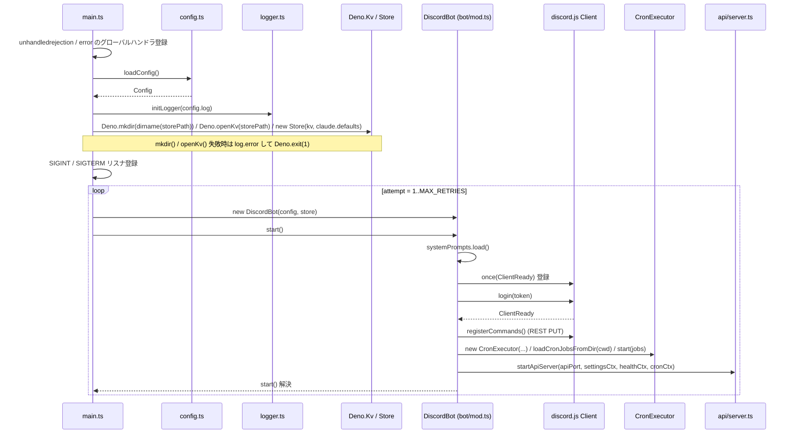

# ライフサイクル (起動 / 終了・設定・ロガー)

プロセスの起動から終了までの流れと、その前提になる設定ファイルの読み込み (`config.ts`) とロガー (`logger.ts`) の仕様をまとめる。エントリポイントは `main.ts` で、`loadConfig()` → `initLogger()` → Deno KV の open → シグナルハンドラ登録 → `DiscordBot.start()` のリトライ、の順に進む。`DiscordBot` (`bot/mod.ts`) は discord.js の `ClientReady` を受けてからスラッシュコマンド登録・cron 初期化・内部 HTTP サーバー起動を行い、`shutdown()` で逆順に畳む。

関連: [README](README.md) / [message-flow](message-flow.md) / [claude-integration](claude-integration.md) / [store-and-settings](store-and-settings.md) / [approval](approval.md) / [cron](cron.md) / [internal-api](internal-api.md) / [deployment](deployment.md)

## 起動シーケンス

## プロセス起動 (`main.ts`)

1. グローバルハンドラ登録: `globalThis` の `unhandledrejection` と `error` イベントにリスナを付け、`log.error()` で記録した上で `e.preventDefault()` を呼ぶ。未処理の reject / 例外でプロセスは終了しない。
2. `loadConfig()` (`config.ts`) で設定を読み込む。失敗時は例外が投げられ、この呼び出しは後述の起動リトライの外側にあるためリトライされない。
3. `initLogger(config.log)` (`logger.ts`) でログレベルとリングバッファ容量を適用する。この呼び出しより前に出るログ (手順 1 のハンドラ経由を含む) は `logger.ts` の既定値 (`INFO` / 1000 件) で扱われる。
4. KV の初期化: `Deno.mkdir(dirname(config.storePath), { recursive: true })` と `Deno.openKv(config.storePath)` を同じ `try/catch` で囲んで実行し、`new Store(kv, config.claude.defaults)` を生成する。KV はリトライループの外側で 1 度だけ開く。`mkdir()` が失敗した場合 (`storeDirReady` フラグが立つ前) は `log.error("failed to prepare store directory: ...")`、`openKv()` が失敗した場合 (フラグが立った後) は `log.error("failed to open store: ...")` を出し、いずれも `Deno.exit(1)` する (ローカル SQLite バックエンドのため起動リトライで回復する見込みが無く、リトライ対象にしない)。
5. シグナルハンドラ: `SIGINT` / `SIGTERM` に同じ `onSignal` を登録する。1 回目は `shuttingDown = true` にして、`let failed = false` を追跡しながら次を非同期に実行する: `try { await bot?.shutdown(); } catch (e) { failed = true; log.error("bot shutdown failed:", e); } finally { try { store.close(); } catch (e) { failed = true; log.error("store close failed:", e); } Deno.exit(failed ? 1 : 0); }`。`store.close()` は `finally` に置くため `bot.shutdown()` が例外を投げても必ず呼ばれる (`bot` が未生成、すなわちリトライ待ち中なら `shutdown()` は no-op)。`bot.shutdown()` / `store.close()` のいずれかが失敗すれば終了コードは `1`、両方成功すれば `0`。2 回目のシグナルは `Deno.exit(1)` で強制終了する。
6. 起動リトライ: `MAX_RETRIES = 5`、`BASE_DELAY_MS = 3_000`。ループの先頭で `shuttingDown` を見て true ならループを抜ける (シグナル受信後に新しい試行が閉じた KV を使う経路を無くすため)。各試行で `new DiscordBot(config, store)` を生成して `await bot.start()` し、成功すればループを抜ける。失敗時は `BASE_DELAY_MS * 2^(attempt - 1)` ミリ秒 (3s, 6s, 12s, 24s) 待って再試行し、`MAX_RETRIES` 回目の失敗で `Deno.exit(1)` する。

KV の open / close は `main.ts` が対で所有する。`Deno.openKv()` で開き、`onSignal` が `bot.shutdown()` の成否に関わらず `finally` で `store.close()` を呼ぶ。`DiscordBot.shutdown()` は Store に触れない。

## `DiscordBot` の組み立て (`bot/mod.ts` コンストラクタ)

`new DiscordBot(config, store)` で次を組み立てる。

| メンバ               | 内容                                                                                                                                                                                                                                                                   |
| -------------------- | ---------------------------------------------------------------------------------------------------------------------------------------------------------------------------------------------------------------------------------------------------------------------- |
| `selfMentionLimiter` | `new SelfMentionRateLimiter(SELF_MENTION_RATE_LIMIT_MAX_COUNT, SELF_MENTION_RATE_LIMIT_WINDOW_MINUTES)` (`bot/ratelimit.ts`、6 回 / 10 分)                                                                                                                             |
| `systemPrompts`      | `new SystemPromptStore(join(config.claude.cwd, ".claude", "system-prompt"))` (`claude/system-prompt.ts`)                                                                                                                                                               |
| `client`             | discord.js `Client`。intents は `Guilds` / `GuildMessages` / `MessageContent` / `GuildMembers`。`partials` は指定しない。`allowedMentions: { parse: [], users: [config.discord.userId] }` で、この Client 経由の送信では認可ユーザー以外へのメンション解決を無効化する |
| `approvalManager`    | `new ApprovalManager(this.client, join(config.claude.cwd, ".claude", "settings.json"))` (`approval/manager.ts`)。内部で `QuestionManager` も生成する                                                                                                                   |
| `chatQueue`          | `new ScopeQueue()` (`bot/queue.ts`)。フィールド初期化子で生成                                                                                                                                                                                                          |
| イベント登録         | `Events.MessageCreate` → `onMessage()`、`Events.InteractionCreate` → `onInteraction()`                                                                                                                                                                                 |

`apiServer` と `cronExecutor` はコンストラクタでは `null` で、`start()` の `ClientReady` ハンドラ内で生成する。

`allowedMentions` の意図、`onMessage()` / `onInteraction()` の中身は [message-flow](message-flow.md) を参照。

## `DiscordBot.start()`

1. `await this.systemPrompts.load()`: `{cwd}/.claude/system-prompt/` 配下の `DEFAULT.md` / `CHAT.md` / `CRON.md` とスコープ別ファイルを読み込みキャッシュする。ディレクトリが無ければスキップする。内容は [claude-integration](claude-integration.md) を参照。
2. `this.client.once(Events.ClientReady, ...)` を `login()` より前に登録する。コード中のコメントによると、discord.js は gateway の READY を受けた時点で `ClientReady` を emit し、それは `login()` の解決前になり得るため、`login()` 後に `once()` を登録すると発火済みイベントを取りこぼし、以下の初期化が実行されなくなる。
3. `ClientReady` ハンドラ内の処理 (この順):
   1. `registerCommands()`: `REST` に token をセットし、`Routes.applicationGuildCommands(client.user.id, config.discord.guildId)` へ `[command.toJSON()]` (`bot/commands.ts` の `command`) を `PUT` する。ギルドスコープのコマンド登録で、グローバルコマンドは登録しない。
   2. `new CronExecutor(client, config.claude, config.discord.guildId, config.discord.token, store, config.claude.defaults, approvalManager, systemPrompts)` (`cron/executor.ts`)。
   3. `loadCronJobsFromDir(config.claude.cwd)` (`cron/loader.ts`) で `{cwd}/cron/*.md` を読み、`cronExecutor.start(jobs)` でスケジューラを開始する。`cron/` が無ければ空配列で開始する。
   4. `reloadJobs` (再読込 → `cronExecutor.reload()`) を定義し、`cronExecutor.setOnceCallback()` に once ジョブ実行後の処理 (`{cwd}/cron/{name}.md` を `Deno.remove()` → `reloadJobs()`) を登録する。削除失敗はログのみで、reload は行う。
   5. `runJobByName` (`findJob()` → `runJob()`、未登録なら throw) を定義する。
   6. `CronRouteContext { reloadCronJobs, runJob, listJobs }`、`SettingsRouteContext { store, resolveParentId }`、`HealthRouteContext { isReady }` を組み立て、`startApiServer(config.claude.apiPort, settingsCtx, healthCtx, cronCtx)` (`api/server.ts`) を呼ぶ。サーバーは `127.0.0.1` にバインドされる。詳細は [internal-api](internal-api.md)。
   7. `ready` Promise を resolve する。
4. `await this.client.login(config.discord.token)`。
5. `await ready` で上記ハンドラの完了を待ってから `start()` が解決する。

cron の詳細は [cron](cron.md)、`SettingsRouteContext` の中身は [store-and-settings](store-and-settings.md) を参照。

## `DiscordBot.shutdown()`

`async shutdown(): Promise<void>`。次の順に呼ぶ。

1. `this.cronExecutor?.stop()`: スケジューラの interval を止める。
2. `this.apiServer?.shutdown()` (reject は `log.warn("api server shutdown error:", e)` で握る) を `withTimeout()` (module 内ヘルパ) で `SHUTDOWN_TIMEOUT_MS` (5 秒、モジュール定数) のタイムアウトと競わせて待つ。タイムアウトした場合は `log.warn("api server shutdown timed out; proceeding")` を出して先へ進む。
3. `this.client.destroy()` (reject は `log.warn("client destroy error:", e)` で握る) も同様に `withTimeout()` で `SHUTDOWN_TIMEOUT_MS` と競わせて待つ。タイムアウト時は `log.warn("client destroy timed out; proceeding")`。

`withTimeout(promise, ms, label)` は `promise` と `ms` のタイマーを `Promise.race` させ、タイマーが先に発火したら `log.warn("<label> timed out; proceeding")` を出して resolve する (reject しない)。渡す `promise` 自体の reject は呼び出し側が事前に `.catch()` で処理する。どちらが先に決着してもタイマーは `clearTimeout()` する。ステップ 2・3 それぞれに独立してタイムアウトが掛かるため、`shutdown()` 全体の最大所要時間は合計最大 10 秒になり得る (`compose.yaml` の `stop_grace_period: 15s` はこれに合わせている)。

Store の `close()` はここでは呼ばない。KV の open / close は `main.ts` が対で所有するため、`main.ts` の `onSignal` が `client.destroy()` の完了 (`bot.shutdown()` の解決、または例外) を受けて `finally` で `store.close()` を呼び、続けて成否に応じた終了コードで `Deno.exit()` する。

`shutdown()` 自体は `Deno.exit()` を呼ばない。

## 設定読み込み (`config.ts` / `config.schema.ts` / `config.schema.json`)

### `loadConfig()` の流れ

1. パス解決: 環境変数 `LOMS_CLAW_CONFIG` があればそれ、無ければ `./data/config.json` (プロセス cwd 基準)。Docker イメージでは `Dockerfile` の `ENV LOMS_CLAW_CONFIG=/data/config.json` が効く。
2. `Deno.readTextFileSync(path)` → `JSON.parse()`。読み込み失敗・パース失敗はそれぞれパスを含むメッセージで throw する。
3. `applyConfigDefaults(raw)` (`config.schema.ts`): `config.schema.json` の `properties` を再帰的に辿り、値が `undefined` のキーに `default` を `structuredClone()` して埋める (破壊的変更)。親の `default: {}` を先に埋めてから子へ再帰するため、`claude` / `log` / `claude.defaults` を丸ごと省略してもネストした既定値まで補完される。`@cfworker/json-schema` には ajv の `useDefaults` に相当する機能が無いため自前で行う。
4. `validateConfigFile(raw)`: `new Validator(schema, "7", false)` (draft-07、`shortCircuit: false` で全エラー収集) による検証。失敗時は `formatConfigErrors(errors)` で各エラーを `- <instanceLocation>: <error>` の行に整形し (ルートは `(root)`)、`config validation failed (<path>):` に続けて throw する。
5. `$schema` キーを取り除く (IDE / tooling 用のメタデータで、schema 上は `type: string` として許可されている)。
6. `claude.cwd` に `Deno.cwd()` を注入して `Config` を返す。`claude.cwd` は schema に無く、JSON に書くと `additionalProperties: false` で拒否される。

schema はトップレベル・`discord`・`claude`・`claude.defaults`・`log` のすべてで `additionalProperties: false` を指定しており、未知のキー (typo を含む) は検証エラーになる。

### フィールド一覧

`config.schema.json` の定義。「既定値」が空のものは `default` を持たず、schema の `required` により書き込み必須になる (`claude.defaults.model` / `effort` は `required` に無く省略可)。

| キー                           | 型                                               | 既定値                   | 備考                                                   |
| ------------------------------ | ------------------------------------------------ | ------------------------ | ------------------------------------------------------ |
| `$schema`                      | string                                           |                          | 任意。実行時 `Config` からは除外される                 |
| `discord.token`                | string (minLength 1)                             |                          | 必須。bot トークン                                     |
| `discord.guildId`              | string (minLength 1)                             |                          | 必須。対象ギルド ID                                    |
| `discord.userId`               | string (minLength 1)                             |                          | 必須。操作を許可する唯一のユーザー ID                  |
| `discord.activeChannelIds`     | string[]                                         | `[]`                     | mention 不要で反応するチャンネル ID の静的ベースライン |
| `storePath`                    | string                                           | `".claude/loms-claw.kv"` | Deno KV ファイルのパス。相対パスはプロセス cwd 基準    |
| `claude.maxTurns`              | number                                           | `10`                     | `query()` の `maxTurns`                                |
| `claude.timeout`               | number                                           | `300000`                 | Claude 呼び出しのタイムアウト (ms)                     |
| `claude.apiPort`               | number                                           | `3000`                   | 内部 HTTP API のポート (cron + ログ + 設定 (settings)) |
| `claude.defaults.model`        | string                                           |                          | 省略可。グローバルデフォルトのモデル                   |
| `claude.defaults.effort`       | enum `low` / `medium` / `high` / `xhigh` / `max` |                          | 省略可。グローバルデフォルトの effort                  |
| `claude.defaults.showThinking` | boolean                                          | `false`                  | thinking を Discord に表示するかのグローバルデフォルト |
| `log.level`                    | enum `DEBUG` / `INFO` / `WARN` / `ERROR`         | `"INFO"`                 | コンソールに出力する最低ログレベル                     |
| `log.bufferSize`               | number (1..10000)                                | `1000`                   | リングバッファ容量                                     |

`claude.cwd` (`Deno.cwd()` 注入) は表に無い。`Config` / `ClaudeConfig` / `ClaudeDefaults` / `LogConfig` / `DiscordConfig` の型は `config.ts` にあり、JSON 側の shape は `ConfigFile` (`claude.cwd` を除いた `Config`) である。

`data/config.json.example` は `$schema` に `../config.schema.json` を指定した雛形で、`storePath` を `.claude/loms-claw.kv`、`claude.defaults` を `model: sonnet` / `effort: medium` / `showThinking: false` としている。`defaults` の各値がどう解決されるかは [store-and-settings](store-and-settings.md) を参照。

## ロガー (`logger.ts`)

- `createLogger(namespace)` が `debug` / `info` / `warn` / `error` を持つ `Logger` を返す。各モジュールはモジュールスコープで `const log = createLogger("<namespace>")` を持つ (`main`、`bot` 等)。
- レベルは `DEBUG < INFO < WARN < ERROR` (`LEVEL_ORDER`)。
- `initLogger({ level, bufferSize })` はモジュール変数 `minLevel` と `bufferCapacity` を上書きする。`bufferSize` は 1..10000 に clamp され、容量が変わる場合のみリングバッファを作り直す (既存エントリは破棄される)。呼ばない場合の既定は `INFO` / 1000 件。`main.ts` は `loadConfig()` 直後に 1 回だけ呼ぶ。
- 出力: 各行は `<ISO timestamp> [<LEVEL>] [<namespace>] <msg> ...args` の形式。`ERROR` は `console.error`、`WARN` は `console.warn`、`DEBUG` / `INFO` は `console.log`。timestamp は `Temporal.Now.instant().toString()`。
- `minLevel` の適用箇所: コンソール出力のみ。リングバッファには `minLevel` に関係なく全レベルのエントリを記録する (`emit()` 内で `pushEntry()` を先に呼び、その後でレベル判定して return する)。
- リングバッファのエントリ (`LogEntry`) は `timestamp` / `level` / `namespace` / `message` を持ち、`message` は引数を `stringifyArg()` で文字列化して連結したもの (string はそのまま、`Error` は `stack` または `name: message`、それ以外は `JSON.stringify`、失敗時は `String()`)。
- `getLogEntries(filter?)`: 時系列順に走査し、`level` (以上)・`namespace` (前方一致)・`since` (`Temporal.Instant.compare()` による時刻比較) でフィルタし、末尾 `limit` 件を返す。`limit` は既定 100、1..1000 に clamp される。
- 消費先は内部 HTTP API の `GET /logs` ([internal-api](internal-api.md))。

`errors.ts` の `getErrorMessage(error)` は `Error` なら `message`、それ以外は `String()` を返す共通ユーティリティで、`loadConfig()` のエラーメッセージ組み立てや各ハンドラの catch で使われる。

## 実行時 cwd とパス

`claude.cwd` はプロセスの `Deno.cwd()` で、ワークスペースのルートになる。

- 本番 (Docker): `Dockerfile` の `WORKDIR /data/workspace` の後に `CMD ["deno", "run", ..., "/app/main.ts"]` を実行するため、cwd は `/data/workspace` (host の `data/workspace` の bind mount)。コードはイメージ焼き込みの `/app` を絶対パスで参照する。
- 開発 (`deno task start` / `deno task dev`): `deno task` は `deno.json` のあるディレクトリを cwd にするため、リポジトリ直下 (devcontainer では `/app`) がワークスペースになる。

cwd 基準で解決されるもの:

| 項目                         | パス                                                          | 参照元                                                      |
| ---------------------------- | ------------------------------------------------------------- | ----------------------------------------------------------- |
| 設定ファイル (既定)          | `./data/config.json` (`LOMS_CLAW_CONFIG` 未設定時)            | `config.ts` `loadConfig()`                                  |
| Deno KV                      | `storePath` が相対なら cwd 基準 (既定 `.claude/loms-claw.kv`) | `main.ts` `Deno.openKv()`                                   |
| システムプロンプト           | `{cwd}/.claude/system-prompt/`                                | `bot/mod.ts` コンストラクタ → `SystemPromptStore`           |
| ツール許可リスト             | `{cwd}/.claude/settings.json`                                 | `bot/mod.ts` コンストラクタ → `ApprovalManager`             |
| cron ジョブ定義              | `{cwd}/cron/*.md`                                             | `cron/loader.ts` `loadCronJobsFromDir()`、once コールバック |
| `query()` の作業ディレクトリ | `{cwd}`                                                       | `claude/mod.ts` `buildQueryOptions()` (`cwd: config.cwd`)   |

Docker / compose / devcontainer / `data/` の構成と環境変数 (`CLAUDE_CONFIG_DIR` / `LOMS_CLAW_CONFIG` / `TZ`) は [deployment](deployment.md) を参照。
