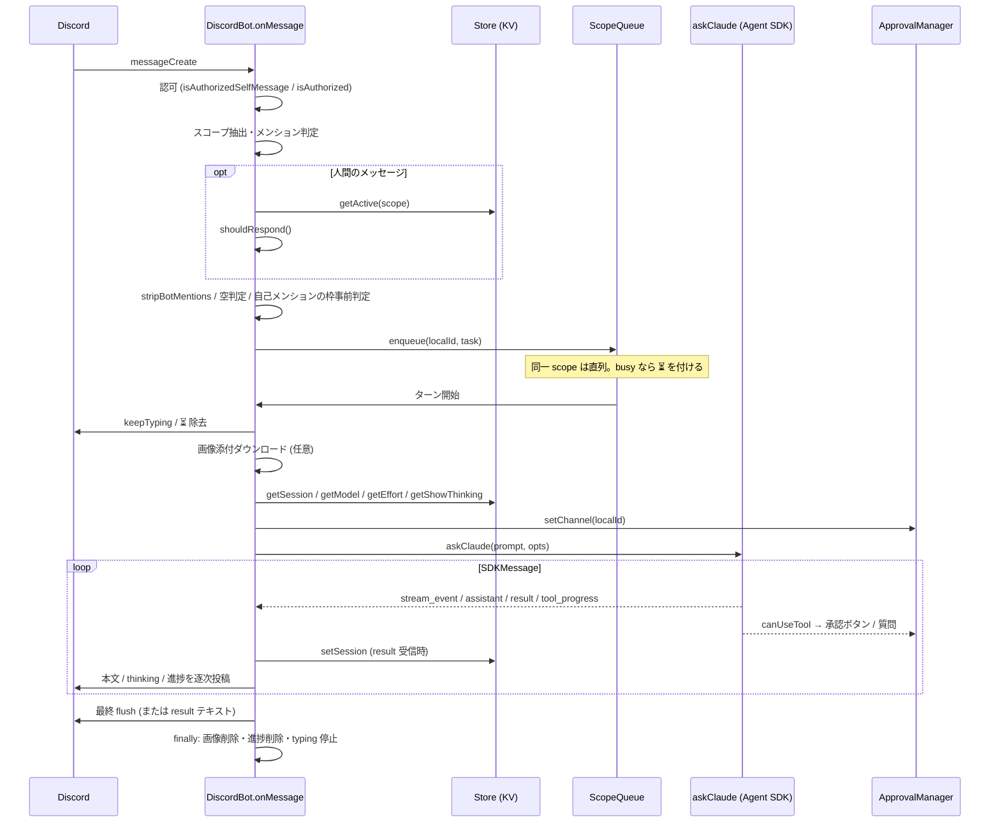

# メッセージ処理 (Discord → Claude → Discord)

`bot/mod.ts` の `DiscordBot` が discord.js の `messageCreate` / `interactionCreate` を受け取り、認可・反応判定・スコープ単位の直列化・画像添付の前処理を経て `askClaude()` を呼び、ストリームを Discord へ流し込むまでの流れを記す。AI to AI 自己メンション (bot 自身の投稿で別スコープのセッションを起動する経路) の発火条件と連鎖制御、インタラクション (ボタン / select / modal / スラッシュコマンド) の振り分けも本章で扱う。

関連: [README](README.md) / [lifecycle](lifecycle.md) / [claude-integration](claude-integration.md) / [store-and-settings](store-and-settings.md) / [approval](approval.md) / [cron](cron.md) / [deployment](deployment.md)

対象ソース: `bot/mod.ts`, `bot/guard.ts`, `bot/queue.ts`, `bot/ratelimit.ts`, `bot/message.ts`, `bot/commands.ts`, `claude/mod.ts` (抽出ヘルパー), `approval/manager.ts` (`createCanUseTool()` の入口)

## 全体像

## `messageCreate` ハンドラ (`DiscordBot.onMessage`)

### 1. 認可

1. `isAuthorizedSelfMessage(message.guildId, message.author.id, botUserId, config)` (`bot/guard.ts`) で「自 bot の user ID かつ `discord.guildId` と一致」なら自己メッセージ (`isSelfMessage = true`) として後続へ進む。`botUserId` は `client.user?.id ?? null`。
2. それ以外は `isAuthorized(message.guildId, message.author.id, message.author.bot, config)` で判定する。bot は無条件に拒否、ギルド ID と `discord.userId` の完全一致を要求する。不一致なら何もせず return。

### 2. スコープ抽出

`scopeFromChannel(message.channel, message.channelId)` (`bot/scope.ts`) が `StoreScope` を組み立てる: スレッドなら `{ channelId: parentId ?? message.channelId, threadId: message.channelId }`、それ以外は `{ channelId: message.channelId }`。`bot/commands.ts` の `scopeFromInteraction()` も同じ関数を使う。`localId = threadId ?? channelId` を「発話があった場所」として、キューのキー・承認ボタンの送信先・テンプレート変数 `discord.channel.id` に使う。スコープの意味は [store-and-settings](store-and-settings.md) を参照。

### 3. メンション判定と反応判定

- `isMentioned = message.mentions.has(client.user, opts)`。自己メッセージのときだけ `opts = { ignoreRepliedUser: true, ignoreEveryone: true, ignoreRoles: true }` を渡し、本文中の明示メンション `<@botId>` のみを数える (bot 投稿への返信ピング・@everyone・role メンションでは true にならない)。人間のメッセージは既定の判定。
- 自己メッセージでメンションが無ければここで return する。bot 自身の全投稿 (応答の分割送信・thinking・進捗・cron 投稿等) がこのハンドラを通るため、KV 読み取りの前に落とす。
- 人間のメッセージは `hasNonBotMentions = message.mentions.users.some((u) => !u.bot)` と `store.getActive(scope)` (per-scope の上書き。未設定なら `undefined`) を求め、`shouldRespond(channelId, activeChannelIds, isThread, parentId, isMentioned, hasNonBotMentions, activeOverride)` で判定する。
  - `shouldRespond()` は内部で `resolveActive()` を呼ぶ。`activeOverride` が boolean ならそれを採用、`undefined` なら `config.discord.activeChannelIds` に `channelId` (スレッドなら親 `parentId` も) が含まれるかで決める。
  - active なら原則反応するが、bot へのメンションが無く他ユーザへのメンションだけがある場合は無視する。active でなければ bot メンション必須。
- 自己メッセージには `active` を適用しない (true でもメンション必須、false でもメンションがあれば反応する)。

### 4. プロンプト抽出

`stripBotMentions(message.cleanContent, [client.user.displayName, guild.members.me.displayName])` (`bot/message.ts`) で bot 宛てメンションの展開結果 (`@表示名`) を除去する。`cleanContent` は `<@botId>` を guild ニックネーム優先の表示名に展開するため、グローバル表示名とニックネームの両方を渡し、長い名前から順に除去する。本文が空で添付も無ければ return。

### 5. 自己メンションのレート枠 (事前判定)

自己メッセージで `SelfMentionRateLimiter.isExhausted()` (`bot/ratelimit.ts`) が true なら WARN ログを出して return する。枠は消費しない (消費は手順 8 の `tryConsume()`)。ここで落とすことで typing・添付ダウンロード等の副作用を起こさない。

### 6. スコープ単位の直列化 (`ScopeQueue`)

`chatQueue.isBusy(localId)` を見てから `chatQueue.enqueue(localId, task)` に積む (`bot/queue.ts`)。同一 key のタスクは投入順に 1 件ずつ実行され、別 key は並行に走る。前のタスクが失敗しても後続は実行される。busy だった場合はメッセージに ⏳ リアクションを付け (fire-and-forget)、自分のターン開始時に bot 自身のリアクションを外す。`isBusy` 判定と `enqueue` の間に await を挟まないことで連投時の順序を保つ。これにより同一セッションへの並行 `query()` と session ID の競合を防ぐ。

以降はキュー内のタスクとして実行される。

### 7. ターン開始時の準備

- `keepTyping(channel, signal)`: 初回 `sendTyping()` の後、10 秒間隔で送り続け、`AbortSignal` で停止する。
- `createProgressReporter(channel)`: `tool_progress` 用。最初の `report()` で 1 件投稿し、以降は同じメッセージを `edit()` する。3 秒未満の呼び出しはスロットルで捨てる。`cleanup()` で削除する。
- `mention = isSelfMessage ? "" : "<@authorId> "`。`sendChunks(text)` は `splitMessage(text, DISCORD_MESSAGE_LIMIT - mention.length)` で分割してから各チャンク先頭に `mention` を付けて `channel.send()` する。`sendThinking(text)` は各行の先頭に `>` と半角スペース (Discord の引用記法) を付け、`splitMessage()` の既定上限で分割し、メンション無しで送る。

### 8. 画像添付とプロンプトの確定

- 添付があれば `downloadImageAttachments(message.attachments.values())`:
  - `contentType` が `image/` で始まるものだけ対象。
  - `fetch(att.url, { signal: AbortSignal.timeout(30_000) })` で取得。非 2xx は WARN を出してスキップ。
  - `resizeImageIfNeeded()`: `ffprobe` で幅・高さを取り、長辺が 1568 px を超える場合のみ `ffmpeg` で縮小して JPEG (`-q:v 4`) に再エンコードする。超えなければ元データのまま。
  - 最初の成功時に `Deno.makeTempDir({ prefix: "loms-claw-img-" })` を作り、`{uuid}{ext}` で保存する (縮小した場合は `.jpg`、それ以外は元の拡張子、無ければ `.bin`)。個別の失敗は WARN を出して次へ進む。
  - `ffmpeg` / `ffprobe` は実行時依存。Dockerfile で `ffmpeg` を apt install している ([deployment](deployment.md))。
- 1 件以上ダウンロードできたら `appendImageReferences(prompt || "この画像について説明して", images)` で `@/abs/path` を空行を挟んで末尾に付加する。
- ここでプロンプトが空なら return (finally の後始末は走る)。
- 自己メッセージなら `tryConsume()` で枠を消費する。超過なら WARN を出して return。消費を query 直前に置くのは、応答しないメッセージで枠を浪費しないため。
- 自己メッセージなら `SELF_MENTION_PROMPT_NOTE` (`[AI to AI 自己メンション] この依頼は認可ユーザー本人の発話ではなく、別のチャンネル/スレッドで動いている自 bot のセッションが投稿したもの。`) を空行を挟んでプロンプト先頭に付ける。

### 9. 設定の取得と `askClaude()` の呼び出し

- 発話者: 人間なら `message.author.id` / `message.author.displayName`。自己メッセージなら `config.discord.userId` と、その表示名 (guild member cache → users cache → ID の順で解決)。
- `store.getSession / getModel / getEffort / getShowThinking` を `Promise.all` で並列取得する (解決順は [store-and-settings](store-and-settings.md))。
- `approvalManager.setChannel(localId)` で承認ボタン・質問の既定送信先を発話場所にする。
- テンプレート変数 `discord.guild.id / discord.guild.name / discord.channel.id (= localId) / discord.channel.name / discord.channel.type ("thread" | "text") / discord.user.id / discord.user.name` を組み、`systemPrompts.resolve("chat", scope, vars)` で追記システムプロンプトを得る ([claude-integration](claude-integration.md))。
- `askClaude(prompt, { sessionId, config: config.claude, discordToken: config.discord.token, signal: AbortSignal.timeout(config.claude.timeout), appendSystemPrompt, model, effort, canUseTool: createCanUseTool(approvalManager, localId) })`。`createCanUseTool()` は `AskUserQuestion` を `requestAnswers()` へ、それ以外を `requestApproval()` へ振り分ける ([approval](approval.md))。

### 10. ストリーム消費

`for await` で `SDKMessage` を 1 件ずつ見る。各イベントは次の順で 1 つの分岐にだけ入る。

| 優先 | 条件                                                                                                      | 処理                                                                                                                                         |
| ---- | --------------------------------------------------------------------------------------------------------- | -------------------------------------------------------------------------------------------------------------------------------------------- |
| 1    | `extractTopLevelTextDelta(event)` が文字列 (`stream_event` かつ `parent_tool_use_id` 無しの `text_delta`) | 未送出の thinking があれば強制 flush。`textBuffer` に追記し、800 文字以上なら境界 flush                                                      |
| 2    | `showThinking` かつ `extractTopLevelThinkingDelta(event)` が文字列 (`thinking_delta`)                     | `thinkingBuffer` に追記し、1500 文字以上なら境界 flush                                                                                       |
| 3    | `event.type === "assistant"` かつ `parent_tool_use_id` 無し                                               | thinking → text の順に強制 flush (assistant ターン 1 件ごとに別投稿へ区切る)                                                                 |
| 4    | `event.type === "result"`                                                                                 | `resultEvent` に保持。`subtype !== "success"` なら WARN (イベント全体を JSON で記録)。`store.setSession(scope, event.session_id)` を即時保存 |
| 5    | `event.type === "tool_progress"`                                                                          | `progress.report(tool_name, elapsed_time_seconds)`                                                                                           |

- `system` / `user` / サブエージェント由来 (`parent_tool_use_id` 有り) のイベントは扱わない。
- 境界 flush: バッファ内で最後の `。` または改行までを送り、残りを保持する。境界が無い場合は何もしないが、閾値の 2 倍以上に達したら全量を強制 flush する (コードブロック・英語・URL が続くケース対策)。
- `showThinking` が false のときは thinking を抽出しない。thinking が流れるかは model / effort 依存。
- `result` 受信時に session を即保存するのは、その後ジェネレータが throw しても session を残すため。`askClaude()` 側で「resume 先が無い」エラー時に新規セッションで 1 回やり直す挙動は [claude-integration](claude-integration.md) を参照。

### 11. ループ後

- thinking → text の順に最終 flush。
- 一度もテキストを送っていなければ (`hasStreamedText` が false)、`extractResultText(resultEvent)` を送る。`result` フィールドが文字列なら `subtype` を問わず採用し、無ければ `errors` / `subtype` から組み立てた Error を throw する。`resultEvent` 自体が無ければ `claude stream ended without result event` を throw する。

### 12. エラーと後始末

- catch: `log.error` の後、`sendChunks("Error: <msg>")` をチャンネルへ送る (送信失敗は握り潰す)。
- finally: ダウンロードした画像の temp ディレクトリを削除 (`cleanupImageFiles`)、進捗メッセージを削除 (`progress.cleanup`)、typing を停止 (`typingController.abort()`)。

## AI to AI 自己メンション

bot 自身が別チャンネル / スレッドに `<@botId> 依頼内容` を投稿すると、そのスコープのセッション (依頼元とは別。そのスコープで人間と進行中の会話があればそれを resume) で応答する。設定項目は無く常時有効。

### 発火条件 (すべて必須、fail-closed)

- `isAuthorizedSelfMessage()`: 投稿者が自 bot の user ID であること (他 bot は `isAuthorized()` で拒否される)、かつ `discord.guildId` のメッセージであること。
- 本文中の明示メンション `<@botId>`。`mentions.has()` を `ignoreRepliedUser / ignoreEveryone / ignoreRoles` 付きで評価するため、返信ピング・@everyone・role メンションでは発火しない。
- `active` は自己メッセージに適用しない (上記手順 3)。

### 連鎖制御

- bot 全体のスライディングウィンドウレート制限 (`SelfMentionRateLimiter`): 直近 10 分間に 6 回まで。到着時に `isExhausted()` で事前判定 (非消費)、query 直前に `tryConsume()` で消費。超過時は WARN ログを出して無視する。枠は予約しないため、busy なスコープに複数の自己メンションが積まれた場合は実行時に改めて弾かれうる。応答が無ければ次の起動も起きないので、超過で無視された連鎖はそこで途切れる (ウィンドウが空けば新たな連鎖は始められる)。
- discord.js `Client` の既定 `allowedMentions: { parse: [], users: [config.discord.userId] }`。bot プロセスが Client 経由で送る全メッセージ (応答・cron 投稿・承認ボタン等) では認可ユーザ宛て以外のメンション解決が無効化され、応答本文に `<@botId>` が紛れても `message.mentions` に自 bot が載らず発火条件を満たさない。Claude が `discord` skill の curl (REST API) で投稿するメッセージには効かない。それが意図した起動経路であり、その側の歯止めは上記レート制限のみ。
- 応答に発話者メンションプレフィックスを付けない (`mention = ""`)。付けると応答自体が再度メンション条件を満たす。
- プロンプト先頭に `SELF_MENTION_PROMPT_NOTE` を付加し、テンプレート変数 `discord.user.id / discord.user.name` は bot 自身ではなく認可ユーザ (`config.discord.userId`) に差し替える。発話者宛てメンションを指示するプロンプトが `<@botId>` を生むのを防ぎつつ、モデルには「依頼は AI からだが主体は本人」と読ませる。

per-scope の停止手段は無い。連鎖を止めるにはレート制限に任せるか bot を再起動する。ツール承認・`AskUserQuestion` は自己起動ターンでも通常どおりそのスコープに投稿され、本人が見ていなければタイムアウトで deny となり依頼元には通知されない ([approval](approval.md))。

### 同一スコープへの自己メンションの注意

応答中のスコープ自身に `<@botId>` を投稿すると、`ScopeQueue` により現在のターンの後ろに積まれ、同じセッションを resume して処理される。依頼元のターン内でその応答を待つとターンが終わらない限り処理されず、`claude.timeout` まで詰まる。自己メンションは別スコープへ投げ、同一ターン内で返信を待たないこと。

### 使い方

エージェント向けの案内は [data/workspace/CLAUDE.md](../../data/workspace/CLAUDE.md) の「AI to AI 自己メンション」節、投稿手順は [discord skill](../../data/workspace/.claude/skills/discord/SKILL.md) を参照。

## インタラクション (`interactionCreate`, `DiscordBot.onInteraction`)

| 種別                                           | 判定                                                 | 委譲先                                                                                                                                                                                                    |
| ---------------------------------------------- | ---------------------------------------------------- | --------------------------------------------------------------------------------------------------------------------------------------------------------------------------------------------------------- |
| ボタン (承認 / 拒否、質問の Cancel)            | `interaction.isButton()`                             | `approvalManager.handleButton(interaction)`                                                                                                                                                               |
| string select (AskUserQuestion の回答)         | `interaction.isStringSelectMenu()`                   | `approvalManager.handleSelect(interaction)`                                                                                                                                                               |
| modal 送信 (AskUserQuestion の Other 自由入力) | `interaction.isModalSubmit()`                        | `approvalManager.handleModal(interaction)`                                                                                                                                                                |
| chat input `/claw settings show\|set\|unset`   | `isChatInputCommand()` かつ `commandName === "claw"` | `isAuthorized(guildId, user.id, user.bot, config)` を通過後、サブコマンド群 `settings` の `show` → `handleSettingsShow`、`set` → `handleSettingsSet`、`unset` → `handleSettingsUnset` (`bot/commands.ts`) |

- ボタン / select / modal のハンドラが throw した場合は ERROR ログを出し、未応答なら ephemeral のエラー文言で `reply()` する。
- スラッシュコマンドは `registerCommands()` で対象ギルドにのみ登録される ([lifecycle](lifecycle.md))。設定コマンドの意味は [store-and-settings](store-and-settings.md)、承認・質問の詳細は [approval](approval.md) を参照。

## 定数一覧

| 定数 / 値                                | 場所                                        | 値      | 用途                                                 |
| ---------------------------------------- | ------------------------------------------- | ------- | ---------------------------------------------------- |
| `DISCORD_MESSAGE_LIMIT`                  | `bot/message.ts`                            | 2000    | 分割送信の上限。本文はメンション長を引いて分割       |
| `FLUSH_THRESHOLD`                        | `bot/mod.ts`                                | 800     | 本文の境界 flush 開始。2 倍 (1600) で強制 flush      |
| `THINKING_FLUSH_THRESHOLD`               | `bot/mod.ts`                                | 1500    | thinking の境界 flush 開始。2 倍 (3000) で強制 flush |
| typing 間隔                              | `bot/message.ts` `keepTyping`               | 10 秒   | `sendTyping()` の再送間隔                            |
| `PROGRESS_THROTTLE_MS`                   | `bot/message.ts`                            | 3000    | 進捗メッセージ更新の最短間隔                         |
| `MAX_IMAGE_DIMENSION`                    | `bot/message.ts`                            | 1568 px | 長辺がこれを超える画像を縮小                         |
| 添付ダウンロードのタイムアウト           | `bot/message.ts` `downloadImageAttachments` | 30 秒   | `fetch` の `AbortSignal.timeout`                     |
| `SELF_MENTION_RATE_LIMIT_MAX_COUNT`      | `bot/ratelimit.ts`                          | 6       | 自己メンション応答の上限回数                         |
| `SELF_MENTION_RATE_LIMIT_WINDOW_MINUTES` | `bot/ratelimit.ts`                          | 10      | 同ウィンドウ長 (分)                                  |
| `claude.timeout`                         | `config.json`                               | 設定値  | `askClaude()` の `AbortSignal.timeout`               |
| `APPROVAL_TIMEOUT_MS`                    | `approval/manager.ts`                       | 5 分    | 承認 / 質問の待ち時間 ([approval](approval.md))      |
