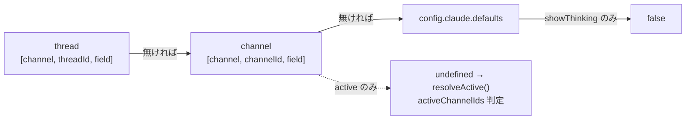

# Store と設定

チャンネル / スレッド単位の設定 (session / model / effort / showThinking / active) を Deno KV に永続化する `Store` (`store/mod.ts`) と、その設定を操作する 2 つの入口 (Discord スラッシュコマンド `/claw settings` と内部 HTTP API `/settings`) の構造を記述する。両入口は `Store.applyPatch()` を共有しており、スコープの決め方と解決順は Store が単一のソースとして定める。

関連: [README.md](README.md) / [message-flow.md](message-flow.md) / [claude-integration.md](claude-integration.md) / [cron.md](cron.md) / [internal-api.md](internal-api.md) / [deployment.md](deployment.md)

## Store の実体

- バックエンドは Deno KV (SQLite backend)。`main.ts` が `Deno.openKv(config.storePath)` で open し、`new Store(kv, config.claude.defaults)` を生成する。KV は起動リトライの外側で 1 度だけ open され、`DiscordBot.shutdown()` 内の `Store.close()` で閉じられる。
- `config.storePath` の既定は `.claude/loms-claw.kv` (相対パスは cwd 基準。`config.schema.json` の `storePath`)。`main.ts` は open 前に親ディレクトリを `Deno.mkdir({ recursive: true })` で作る。
- グローバルデフォルトは `config.json` の `claude.defaults` (`model` / `effort` / `showThinking`) で、`Store` のコンストラクタ引数 `StoreDefaults` として渡される。`getDefaults()` はそのコピーを返す。

### キー配置

```
["channel", id, field] -> string
```

| 要素    | 値                                                                                                                         |
| ------- | -------------------------------------------------------------------------------------------------------------------------- |
| `id`    | leaf id = `threadId ?? channelId`。Discord Snowflake (チャンネル / スレッドのどちらも) または cron の擬似 id `cron:{name}` |
| `field` | `session` / `model` / `effort` / `showThinking` / `active`                                                                 |
| 値      | 常に文字列。boolean (`showThinking` / `active`) は `"true"` / `"false"` で格納する                                         |

thread と channel は同一の Snowflake 名前空間で衝突しないため、親子関係はキーに持たず、`id` だけで使い分ける (`store/mod.ts` 冒頭のコメント)。

### StoreScope

```ts
interface StoreScope {
  channelId: string;
  threadId?: string;
}
```

| 発話場所 / 用途 | scope                                         | 抽出箇所                                                                                                                 |
| --------------- | --------------------------------------------- | ------------------------------------------------------------------------------------------------------------------------ |
| スレッド外      | `{ channelId }`                               | `bot/scope.ts` `scopeFromChannel()`。`bot/mod.ts` (messageCreate) と `bot/commands.ts` `scopeFromInteraction()` から呼ぶ |
| スレッド内      | `{ channelId: parentId, threadId }`           | 同上。`parentId` が null のときは thread id 自体を `channelId` に入れる                                                  |
| cron ジョブ     | `{ channelId: "cron:{name}" }` (session のみ) | `cron/executor.ts`。詳細は後述                                                                                           |

`api/routes/settings.ts` (`GET` / `PATCH` / `DELETE /settings/{id}`) は `bot/scope.ts` を使わず、`resolveParentId` で親を引いて別途スコープを組む (詳細は後述の `resolveScope()`)。親が取れないスレッドの扱いは bot 側 (`{ channelId: id, threadId: id }`) と API 側 (`{ channelId: id }`) で異なる (既存挙動。統一は別 issue)。

書き込み (`setSession` / `applyPatch` / `clearScope`) は常に leaf id (`threadId ?? channelId`) に対して行われる。スレッド内で `/claw settings set` を叩いても親チャンネルのキーには触れない。

## 解決順

読み取り側 (`getModel` / `getEffort` / `getShowThinking` / `getActive` / `getSession` / `getScopeSettings`) のフォールバックはキーごとに異なる。

| キー           | 解決順                                                      | どこにも無いとき                                                                                                      |
| -------------- | ----------------------------------------------------------- | --------------------------------------------------------------------------------------------------------------------- |
| `session`      | leaf id のみ (thread と channel で独立、フォールバック無し) | `undefined` (新規セッション)                                                                                          |
| `model`        | thread → channel → `config.claude.defaults.model`           | `undefined`                                                                                                           |
| `effort`       | thread → channel → `config.claude.defaults.effort`          | `undefined`                                                                                                           |
| `showThinking` | thread → channel → `config.claude.defaults.showThinking`    | `false`                                                                                                               |
| `active`       | thread → channel                                            | `undefined`。呼び出し側 `resolveActive()` (`bot/guard.ts`) が config の `activeChannelIds` リスト判定へフォールバック |



`resolveActive(channelId, activeChannelIds, isThread, parentId, override)` は `override` (KV の値) が boolean ならそれを返し、`undefined` なら `activeChannelIds.includes(channelId) || (isThread && activeChannelIds.includes(parentId))` を返す。スレッドでは親チャンネル ID もリスト判定の対象になる。KV で `false` を明示すると config で active なチャンネルでも mention 必須へ落ちる。`bot/mod.ts` は人間のメッセージに対してのみ `getActive(scope)` を引いて `shouldRespond()` に渡す (bot 自身の投稿には `active` を適用しない。詳細は [message-flow.md](message-flow.md))。

### `getScopeSettings(scope)` の返り値

```ts
interface ScopeSettings {
  session?: string;
  model?: { value: string; source: "thread" | "channel" | "default" };
  effort?: { value: string; source: "thread" | "channel" | "default" };
  showThinking: { value: boolean; source: "thread" | "channel" | "default" };
  active?: { value: boolean; source: "thread" | "channel" };
}
```

- `model` / `effort` は defaults にも無ければ `undefined`。
- `showThinking` はどこにも無くても `{ value: false, source: "default" }` を必ず返す。
- `active` は thread / channel どちらにも上書きが無ければ `undefined` (JSON 化時はフィールドごと省略)。`source` に `default` は現れない。
- `session` は `threadId` があれば thread の値、無ければ channel の値。thread scope で channel の session は読まない。
- 読み取りは `kv.getMany()` で thread 5 キー + channel 5 キーを一括取得する。

## 書き込み API

### `applyPatch(scope, patch)`

`SettingsPatch` は JSON Merge Patch (RFC 7386) の意味論に従う。

```ts
interface SettingsPatch {
  model?: string | null;
  effort?: string | null;
  showThinking?: boolean | null;
  active?: boolean | null;
  session?: null;
}
```

- キー省略 = 触らない、`null` = そのキーを削除 (フォールバックへ戻す)、値あり = leaf id に書く。
- すべての set / delete を 1 つの `kv.atomic()` にまとめて commit する。一部だけ適用された状態を残さない。
- `session` は型で `null` のみ受け付ける (削除専用)。任意のセッション ID の書き込みを許すと他スコープの会話を乗っ取れるため。
- 返り値は `getScopeSettings(scope)` の結果。渡した scope に `threadId` が無ければ thread のフォールバックは効かない。

### `clearScope(scope)`

`kv.list({ prefix: ["channel", id] })` で leaf id 配下のキーを列挙し、1 つの `kv.atomic()` で全削除する。thread scope なら thread のキーだけ消え、親チャンネルの設定は残る。channel scope なら channel のキーだけ消え、配下スレッドの設定は残る。

### 個別 setter / deleter

`setSession` は本番で使われる。`bot/mod.ts` と `cron/executor.ts` が `result` イベント受信時に `event.session_id` を保存する (ジェネレータが非ゼロ終了で throw してもセッションが残るよう、result を受け取った時点で即座に書く)。

`setModel` / `setEffort` / `setShowThinking` / `deleteSession` / `deleteModel` / `deleteEffort` / `deleteShowThinking` は `store/mod.ts` に定義されているが、本番コードからは呼ばれていない (呼び出し元は `store/mod.test.ts` のみ)。本番の書き込み経路は `setSession` / `applyPatch` / `clearScope` の 3 つ。

## Discord スラッシュコマンド `/claw settings`

`bot/commands.ts` にコマンド定義 (`SlashCommandBuilder`) とハンドラを置き、`bot/mod.ts` の `onInteraction()` がサブコマンド名でディスパッチする。interaction は `isAuthorized()` を通過したものだけが処理される。応答はすべて `MessageFlags.Ephemeral`。

| サブコマンド | オプション                                                                                                                                             | 処理                                                                                      |
| ------------ | ------------------------------------------------------------------------------------------------------------------------------------------------------ | ----------------------------------------------------------------------------------------- |
| `show`       | 無し                                                                                                                                                   | `handleSettingsShow()`。`getScopeSettings()` と `resolveActive()` の結果を表示            |
| `set`        | `model` (opus / sonnet / haiku), `effort` (low / medium / high / xhigh / max), `show_thinking` (boolean), `active` (boolean)。すべて任意、1 つ以上必須 | `handleSettingsSet()`。指定されたオプションだけを `SettingsPatch` に詰めて `applyPatch()` |
| `unset`      | `target` (必須): `model` / `effort` / `show_thinking` / `active` / `session`                                                                           | `handleSettingsUnset()`。`applyPatch(scope, { [key]: null })`                             |

- `set` に `session` オプションは無い。session は `unset` (削除) のみ。`SettingsPatch.session?: null` の型と一致する。
- スラッシュコマンドのオプション名は snake_case (`show_thinking`)、Store / API のキー名は camelCase (`showThinking`)。ハンドラが `patch.showThinking` に詰め替える。他の 4 つ (`model` / `effort` / `active` / `session`) は同名。
- `scopeFromInteraction()` は `interaction.channel` を `bot/scope.ts` の `scopeFromChannel()` に渡すだけの薄いラッパ。messageCreate 側 (`bot/mod.ts`) のスコープ抽出も同じ `scopeFromChannel()` を使う。
- `show` が表示する内容:
  - 現在スコープ (Thread + parent、または Channel) の `session` / `model` / `effort` / `show_thinking` / `active`。文字列設定は `value (source)`、`active` は `resolveActive()` で求めた実効値と出所 (KV に無ければ `config activeChannelIds`)
  - グローバルデフォルト (`config.claude.defaults` の `model` / `effort` / `show_thinking`)
  - cron ジョブ一覧 (`CronExecutor.listJobs()` の名前と schedule。executor 未初期化なら `not initialized`)

## 内部 HTTP API `/settings`

`api/routes/settings.ts` の `createSettingsRoutes(ctx)` が Hono ルートを返し、`api/server.ts` が `/settings` にマウントする。`ctx: SettingsRouteContext { store, resolveParentId? }` は `bot/mod.ts` が `startApiServer()` に渡す (`resolveParentId` には `DiscordBot.resolveThreadParentId()` を注入)。API 全体の構成は [internal-api.md](internal-api.md)、エージェント向けの curl 手順は `data/workspace/.claude/skills/settings/SKILL.md` を参照。

| メソッド / パス         | 処理                                                                                                                                                                         |
| ----------------------- | ---------------------------------------------------------------------------------------------------------------------------------------------------------------------------- |
| `GET /settings/default` | `store.getDefaults()` を `{ model, effort, showThinking: showThinking ?? false }` で返す。`/:id` より先に登録                                                                |
| `GET /settings/:id`     | `resolveScope(ctx, id)` → `getScopeSettings(scope)`                                                                                                                          |
| `PATCH /settings/:id`   | body を `RequestPatchSettings` スキーマで検証 (`api/validate.ts` の `matchesSchema()`)、不適合は 400。`resolveScope()` → `applyPatch(scope, body)`。返り値は `ScopeSettings` |
| `DELETE /settings/:id`  | `resolveScope()` → `clearScope(scope)`。`{ ok: true }` を返す                                                                                                                |

### `resolveScope()`

`{id}` がスレッドか通常チャンネルかの判定はサーバ側で行う。

1. `ctx.resolveParentId` が未注入なら `{ channelId: id }`。
2. 注入済みなら呼び出し、親 ID が返れば `{ channelId: parentId, threadId: id }`、`null` なら `{ channelId: id }`。
3. `resolveParentId` が throw した場合 (存在しない ID、`cron:{name}` 等の擬似 id で `channels.fetch()` が失敗するケース) は握りつぶして `{ channelId: id }` へフォールバックする。`resolveThreadParentId()` 側は例外を素通しする設計。

書き込み先は leaf id なので、スレッド判定の成否は PATCH / DELETE の書き込み先を変えない。差が出るのは GET / PATCH の応答 (解決結果) に thread → channel フォールバックが効くかどうかだけ。

リクエスト / レスポンスのスキーマは `docs/api/components/schemas/ScopeSettings.yaml` と `RequestPatchSettings.yaml` が正で、`api/internal-schemas.ts` (生成物) を通じて検証と型の単一ソースになる。`RequestPatchSettings` は `additionalProperties: false` / `minProperties: 1`、`session` は `type: "null"` のみ。

## cron との関係

`cron/executor.ts` の実行時:

- session: `resumeSession: true` のジョブだけが `{ channelId: "cron:{name}" }` で `getSession()` / `setSession()` する。`false` (既定) なら読みも書きもしない。
- model / effort: frontmatter (`job.model` / `job.effort`) → `getModel({ channelId: job.channelId })` / `getEffort({ channelId: job.channelId })` (ジョブに `channelId` がある場合のみ。Store 内で channel → defaults へフォールバック) → executor の defaults。`cron:{name}` スコープの model / effort は読まない。
- showThinking / active は cron では参照しない。

ジョブ定義と実行の詳細は [cron.md](cron.md)。

## テスト

`store/mod.test.ts` は `Deno.openKv(":memory:")` で開いたインメモリ KV を `Store` に渡して実コードを通す (モック無し)。各 step で新しい KV を開き、終了時に `kv.close()` する。
